#### **UNITY 2022 LTS EDITION** ⟶ E-BOOK

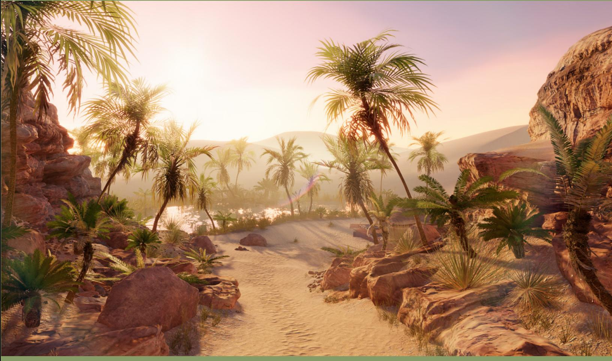

# 80+ tips to increase productivity with Unity 2022 LTS

### **Contents**

| Introduction 5                                    |
|---------------------------------------------------|
| Editor workflows 6                                |
| The Package Manager 7                             |
| Shortcuts Manager 8                               |
| Focused Inspectors 10                             |
| Presets 11                                        |
| Scene visibility 12                               |
| Scene picking 14                                  |
| Searching 15                                      |
| Query Builder 17                                  |
| Inspector Debug Mode 18                           |
| 10 small workflow tips 19                         |
| Artist workflows 24                               |
| 2D artist tips 25                                 |
| Pro 2D tips from the creators of Happy Harvest 32 |
| Prefab workflows 35                               |
| Material Variants 37                              |
| TextMeshPro 38                                    |
| Splines 39                                        |
| Snapping 40                                       |
| Animation workflow 42                             |
| Optimization tip 44                               |
| Custom gizmos and icons 45                        |
| UI Toolkit 46                                     |

| Progressive Lightmapper 47                      |
|-------------------------------------------------|
| Light Probes 49                                 |
| Adaptive probe volumes 51                       |
| Tips for the Universal Render Pipeline 52       |
| Tips for the High Definition Render Pipeline 58 |
| Developer workflows 63                          |
| Attributes 63                                   |
| Custom windows and Inspectors 65                |
| Custom menus 66                                 |
| Enter Play Mode settings 66                     |
| Enter Play Mode optimizations 67                |
| Script templates 67                             |
| Addressables 69                                 |
| Preprocessor directives 72                      |
| ScriptableObjects 73                            |
| More resources 75                               |
| Managing assemblies 76                          |
| IDEs and Debugging 77                           |
| Debugging 78                                    |
| Additional debugging tips 81                    |
| Visual Studio shortcuts 83                      |
| Device Simulator 83                             |
| Console Log Entry 85                            |
| Custom Compiler status 86                       |
| More resources 86                               |

| Team workflows 87                                  |  |
|----------------------------------------------------|--|
| Unity Version Control 88                           |  |
| Migrating from Git 88                              |  |
| Unity Build Automation 90                          |  |
| Unity Accelerator 90                               |  |
| Unity Build Server 91                              |  |
| Resources for all Unity developers 92              |  |
| Remove roadblocks with Unity Integrated Success 93 |  |

### <span id="page-4-0"></span>Introduction

This guide provides over 80 tips on how to work faster with Unity's programmer and artist toolsets. It covers many of the new features in Unity 2022 LTS along with plenty of time-saving steps and workflows that have been a part of Unity for years.

When you work in Unity every day, each second or mouse click adds up. We want you to be able to waste less time and be more productive. Whether you're a new or experienced Unity developer, this guide can help you to speed up workflows in every stage of your game development.

Go to the [Unity 2022 LTS site](https://unity.com/releases/lts) or to the [New in Unity 2022](https://docs.unity3d.com/Manual/WhatsNew2022LTS.html) section of Unity documentation to get the full story of its new features and capabilities.

Many teams at Unity work to improve the quality of life for our creators, such as the [Accelerate Solutions team](https://unity.com/solutions/accelerate-solutions-games?), who contributed their valuable knowledge to this guide. The Accelerate Solutions team supports a plethora of Unity customers to help them get the most out of the engine. They identify, and help to optimize, critical points in projects for speed, stability, and efficiency.

### <span id="page-5-0"></span>Editor workflows

Unity 2022 LTS includes multiple improvements that speed up Editor workflows, such as new search options to help you find things faster, granular capabilities for the Shortcut Manager, optimizations for large-scale projects, improvements to Play mode, more flexible layouts and advanced styling options in UI Toolkit, and much more.

Collectively, these improvements can save you hours of work over days and weeks because you can iterate faster and develop more efficiently. Try out these tips and shortcuts to go faster in Unity.

Here are some of the behind-the-scenes Editor improvements in Unity 2022 LTS:

- Improved package retrieval process when loading Editor window
- Less time to enter Play mode
- Less time taken by static batching when entering Play mode or making a build
- Improved performance of picking large objects in Scene view
- Improved performance of Scene view with many LODGroups selected
- Optimized prefab editing: 20% off the cost of changing a large prefab
- Editor workflow optimizations for large scale projects:
	- Faster hierarchy scrolling and picking of objects
	- Optimized multi-selection of GameObjects
	- Improved performance when you preview many textures
- <span id="page-6-0"></span>— Reduced hitches when you change to large prefabs
- Improved performance when creating a new asset (especially in a large project)
- Optimized StripPrefabObjectsWhichAreNotUsed: 28% speedup for large scenes

#### The Package Manager

| Package Manager                                                           |       |                                                                                                                                                                           |     | : ■×         |
|---------------------------------------------------------------------------|-------|---------------------------------------------------------------------------------------------------------------------------------------------------------------------------|-----|--------------|
| + + Packages: Unity Registry ▼ Sort: Name (asc) ▼ Filters ▼ Clear Filters |       |                                                                                                                                                                           | : Q |              |
| All<br>Services                                                           |       |                                                                                                                                                                           |     |              |
| T Features                                                                | 4     | Mobile                                                                                                                                                                    |     | Install      |
| 2D<br>8<br>8 packages                                                     |       | Release                                                                                                                                                                   |     |              |
| 3D Characters and Animation<br>08<br>4 packages                           |       | From Unity Registry by Unity Technologies Inc.                                                                                                                            |     |              |
| 3D World Building<br>23<br>4 packages                                     |       | com.unity.feature.mobile                                                                                                                                                  |     | [ QuickStart |
| AR<br>00<br>5 packages                                                    |       | Description<br>Packages Included                                                                                                                                          |     |              |
| Cinematic Studio<br>0<br>6 packages                                       |       | Optimize your apps for mobile devices and provide a performant experience<br>for your users. Includes utilities for debugging on device and support for<br>notifications. |     |              |
| Engineering<br>8<br>7 packages                                            |       |                                                                                                                                                                           |     |              |
| Gameplay and Storytelling<br>20<br>3 packages                             |       |                                                                                                                                                                           |     |              |
| & Mobile<br>3 packages                                                    |       |                                                                                                                                                                           |     |              |
| 8 VR<br>2 packages                                                        |       |                                                                                                                                                                           |     |              |
| Packages                                                                  |       |                                                                                                                                                                           |     |              |
| 2D Animation                                                              | 9.0.3 |                                                                                                                                                                           |     |              |
| 2D Aseprite Importer                                                      | 1.0.1 |                                                                                                                                                                           |     |              |
| 2D Pixel Perfect                                                          | 5.0.3 |                                                                                                                                                                           |     |              |
| Last update Aug 31, 14:06                                                 | C     |                                                                                                                                                                           |     |              |
|                                                                           |       |                                                                                                                                                                           |     |              |

The updated Package Manager interface

Updates to the [Package Manager i](https://docs.unity3d.com/2022.1/Documentation/Manual/upm-ui.html)n Unity 2022 LTS help you save time while you import and organize your packages:

- Support for [multiple selection](https://docs.unity3d.com/Manual/upm-ui-multi.html) in the Package Manager window; apply the same operation to multiple packages at once, rather than applying each operation individually
- Improvements to the workflow for [importing complete projects from the](https://docs.unity3d.com/Manual/upm-ui-import.html#complete-proj)  [Asset Store](https://docs.unity3d.com/Manual/upm-ui-import.html#complete-proj); import complete projects into a temporary project where you can safely explore the content without impact to your main project
- Redesigned [Filters](https://docs.unity3d.com/Manual/upm-ui-filter2.html) and [Sorting](https://docs.unity3d.com/Manual/upm-ui-sort.html) controls in the Unity Registry, My Registries, In Project, and My Assets lists
- A Check for Updates option added to the Refresh list in the [My Assets list](https://docs.unity3d.com/Manual/upm-ui.html); use this option to check for updates to all packages on your computer, not just the ones that are visible in the My Assets list
- A new Update button to automatically update a Git package to the latest version

#### Shortcuts Manager

The [Shortcuts Manager](https://docs.unity3d.com/2022.3/Documentation/Manual/ShortcutsManager.html) is an interactive visual interface to help you manage Editor hotkeys. Here, you can assign shortcuts to different contexts and visualize existing bindings for any tools that you use frequently.

<span id="page-7-0"></span>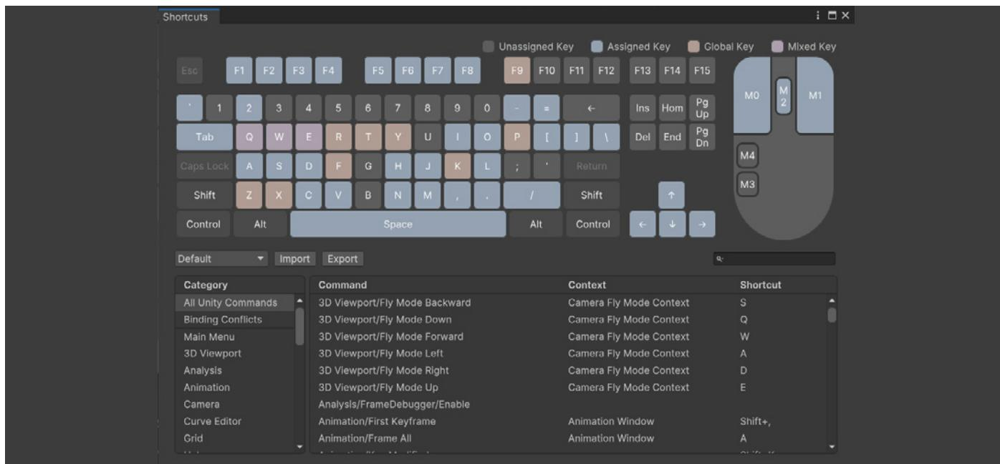

The Shortcuts Manager

Bind any key or combination of keys, to a Unity Editor command. For example, the R key is bound by default to the Scale tool in the Tools context.

The **Binding Conflicts** Category also identifies if you have a shortcut assigned to two commands that can be executed at the same time. Use the interface to resolve such conflicts. Note: You *can* assign the same shortcut to multiple commands if they are in different contexts and cannot execute at the same time.

| Category           | Command                                                    | Shortcut |      |
|--------------------|------------------------------------------------------------|----------|------|
| All Unity Commands | HDRP/Decal: Handle swap between cropping and stretching UV | 36W      | A  . |
| Binding Conflicts  | Main Menu/File/Close                                       | 36 W     | 4    |
| Main Menu          |                                                            |          |      |

Identify Binding Conflicts between shortcuts

Access the Shortcuts Manager from Unity's main menu:

- On Windows and **Linux**, select **Edit > Shortcuts**.
- On macOS, select **Unity > Shortcuts**.

Use the provided API in the [UnityEditor.ShortcutManagement](https://docs.unity3d.com/2019.1/Documentation/ScriptReference/ShortcutManagement.ActiveProfileChangedEventArgs.html?) namespace to define custom shortcuts in your own scripts and packages.

#### Common Shortcuts

Here are some common default shortcuts:

| Action                              | Windows          | Mac              |
|-------------------------------------|------------------|------------------|
| Frame Selected                      | F                | F                |
| Duplicate Items                     | Ctrl + D         | Cmd + D          |
| Delete GameObject                   | Shift + Del      | Cmd + Delete     |
| View/Move/Rotate/Rect/<br>Transform | Q/W/E/R/T        | Q/W/E/R/T        |
| Toggle Pivot Mode                   | Z                | Z                |
| Toggle Pivot Rotation               | X                | X                |
| Vertex Snap                         | V                | V                |
| Snap                                | Ctrl + LMB       | Cmd + LMB        |
| Toggle Maximize                     | Shift + spacebar | Shift + spacebar |
| Edit Prefab in Context              | P                | P                |

| Command                  | Shortcut |
|--------------------------|----------|
| View                     | Q        |
| Move                     | W        |
| Rotate                   | E        |
| Scale                    | R        |
| Rect                     | T        |
| Transform                | Y        |
| Toggle Pivot Position    | Z        |
| Toggle Pivot Orientation | ×        |
|                          |          |

Common Editor shortcuts

#### <span id="page-9-0"></span>Focused Inspectors

The [Focused Inspector window](https://docs.unity3d.com/2022.3/Documentation/Manual/InspectorFocused.html) allows you to inspect the properties for a specific GameObject, component, or asset. It always displays the properties of the item you opened it for, even if you select something else in the Scene.

Right-click on a GameObject or Component, and choose **Properties**. This reveals a floating Inspector window that you can reposition, dock, or resize like any other window.

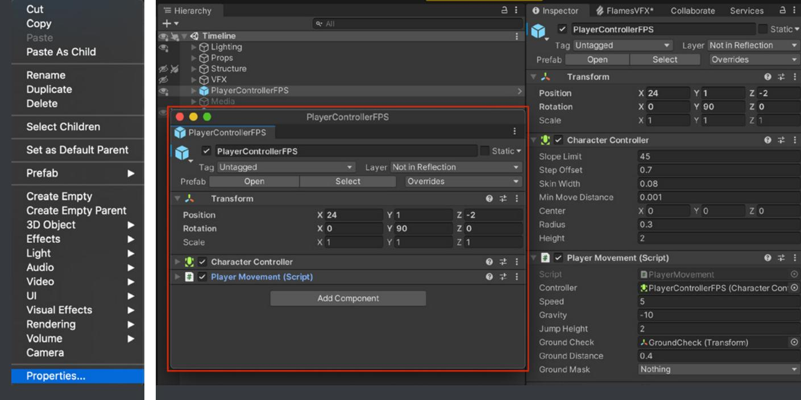

A Focused Inspector comparing two GameObjects

| Reset                    |
|--------------------------|
| Move to Front            |
| Move to Back             |
| Copy Component           |
| Paste Component As New   |
| Paste Component Values   |
| Find References In Scene |
| Properties               |
| Reset Position           |
| Reset Rotation           |
| Reset Scale              |
| Copy Position            |
| Paste Position           |
| Copy Rotation            |
| Paste Rotation           |
| Copy Scale               |
| Paste Scale              |
| Copy World Placement     |
| Paste World Placement    |

Opening multiple Focused Inspectors at the same time allows you to reference multiple GameObjects while making changes to the Scene.

You can also focus on a specific Component of a GameObject, requiring less screen space.

#### <span id="page-10-0"></span>Presets

Presets enable you to customize the default state of anything in your Inspector. Creating a [Preset](https://docs.unity3d.com/2022.3/Documentation/Manual/Presets.html?) lets you copy the settings of a component or asset, save it as an asset, then apply the same settings to another item later.

Use Presets to enforce standards or to apply reasonable defaults to new assets. This ensures consistent standards across your team, so commonly overlooked settings don't impact your project's performance.

| 00<br>Transform |     |     |     | � 花 |
|-----------------|-----|-----|-----|-----|
| Position        | X 0 | Y O | Z O |     |
| Rotation        | X 0 | Y O | Z 0 |     |
| Scale           | × 1 | Y 1 | Z 1 |     |

The Preset icon is highlighted here in red.

Click the Preset icon to the top right of the component. Click **Save current to…** to save the Preset as an asset. Click one of the available Presets to load a set of values.

|                 |                 | @ Inspector                                    |                                          | a :         |
|-----------------|-----------------|------------------------------------------------|------------------------------------------|-------------|
| Select Preset   |                 | Wood_tiled_01_a (Texture 2D) Import Settings   |                                          | 8 花 :       |
|                 |                 |                                                |                                          | Open        |
| Q               |                 | Texture Type                                   | Default                                  |             |
|                 |                 | Texture Shape                                  | 2D                                       | >           |
|                 |                 | sRGB (Color Texture)                           | >                                        |             |
|                 |                 | Alpha Source                                   | Input Texture Alpha                      |             |
|                 |                 | Alpha Is Transparency<br>Ignore PNG file gamma |                                          |             |
|                 | 1               | Advanced                                       |                                          |             |
|                 |                 | Wrap Mode                                      | Repeat                                   |             |
|                 |                 | Filter Mode                                    | Trilinear                                |             |
|                 |                 | Aniso Level                                    | 9                                        |             |
|                 |                 | Default                                        | 0                                        |             |
|                 |                 | Override For PC, Mac & Linux Standalone        |                                          |             |
| None            | AlbedoTexture_D | Max Size                                       | 4098                                     |             |
|                 |                 | Resize Algorithm                               | Mitchell                                 |             |
|                 |                 | wood_tilled_01_a                               | RGB R G B C -                            | 6 %         |
| 1<br>1          | 1               |                                                | 2048x2048 RGB Compressed DXn sRGB 2.7 MB |             |
| NormalTexture   | Utility Texture |                                                |                                          | 0           |
|                 |                 | AssetBundle<br>None                            |                                          | None<br>a : |
|                 |                 | Project<br>+ ▼<br>ರ                            |                                          | @ @ \$15    |
|                 |                 | wood_d                                         |                                          |             |
|                 |                 | wood_n<br>wood_tiled_01_a                      |                                          |             |
| Save current to |                 | wood_tilled_01_n<br>wood_tiled_02_a            |                                          |             |
|                 |                 | wood_tiled_02_n<br>wood tilad 02 a             |                                          |             |

In this example, the Presets contain different Import Settings for 2D textures depending on usage (albedo, normal, or utility).

<span id="page-11-0"></span>Other handy ways to use Presets:

- **Create a GameObject with defaults:** Drag and drop a Preset asset into the Hierarchy in order to create a new GameObject with the corresponding component filled in with Preset values.
- **Associate a specific Type with a Preset:** In the **Preset Manager** (**Project Settings > Preset Manager**), specify one or more Presets per Type. Creating a new component will then default to the specified Preset values.
	- Pro tip: Create multiple Presets per Type, and rely on the Filter to associate the correct Preset by name.
- **Save and load manager settings:** Use Presets for a Manager window, so the settings can be reused; for example, if you plan to reapply the same Tags and Layers or Physics settings, Presets can reduce set up time for your next project.

#### Scene visibility

As your Scene grows larger, you can temporarily hide specific objects so that you can select and edit your GameObjects with more ease.

Instead of deactivating the GameObjects (which can lead to unintended behavior), toggle the SceneVisibility controls. This allows you to hide and show objects in the Scene view, without changing their in-game visibility.

Use the toolbar in the **Hierarchy** window to enable or disable the Scene visibility for GameObjects in the viewport.


Hide objects in the Scene view using SceneVisibility controls.

Note that the status icons may change in the Hierarchy, depending on whether parent or child objects become hidden.

| Icon | Status                                                                                                   |
|------|----------------------------------------------------------------------------------------------------------|
|      | The GameObject is visible, but some of its children are hidden.                                          |
|      | The GameObject is hidden, but some of its children are visible.                                          |
|      | The GameObject and its children are visible, but they only appear<br>when you hover over the GameObject. |
|      | The GameObject and its children are hidden.                                                              |

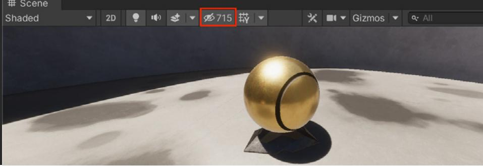

Toggle the Scene view control bar on or off to override the global Scene visibility.

Use **Isolation View** to concentrate on a specific object and its children. Select the GameObject in the Hierarchy window and press **Shift + H** to toggle it on and off. This overrides your other Scene visibility settings until you exit.


Isolation View allows you to edit a GameObject without distractions.

Remember that you can always use the **Shift + spacebar** shortcut to maximize the viewport and hide the rest of the Editor as well.

#### <span id="page-13-0"></span>Scene picking

You can modify the pickability state of GameObjects, similar to Scene visibility. Use the toolbar to block specific GameObjects from being selected in the Scene view. This is useful to avoid selecting and editing an unintended GameObject in large scenes.


Because you can toggle pickability for a whole branch or a single object, some GameObjects may be pickable but have children or parents that are not. The following icons differentiate their status.

| Icon | Status                                                                                             |
|------|----------------------------------------------------------------------------------------------------|
|      | You can pick the GameObject, but you cannot pick some of its<br>children.                          |
|      | You cannot pick the GameObject, but you can pick some of its<br>children.                          |
|      | You can pick the GameObject and its children (only appears when<br>you hover over the GameObject). |
|      | You cannot pick the GameObject or its children.                                                    |

#### <span id="page-14-0"></span>Searching

Search functionality in the Editor has improved in the recent LTS releases, and in 2022 LTS, there are several ways for you to search efficiently in Unity. Besides the search functionality in the Hierarchy and Project views, you can also use the search button icon in the main menu bar or use the Ctrl + K shortcut.

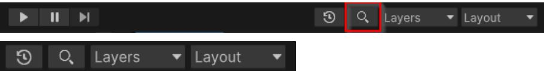

This opens a search window where it's easy to filter your search. The top section of the Landing page allows you to select a search area (search provider) for your search. Clicking on a search area block will filter out the queries and recent searches below. Double-clicking on a search area block will insert the filter token of this area in the search field to help you narrow down your search.


The updated Search window


The Search window with queries

The middle section shows a list of queries available for the currently selected search area. You can click on any query to execute it. The queries are either SearchTemplates, queries generated dynamically for a given search area when the [SearchTemplate] attribute is used in code, or they can be normal SearchQuery that have been tagged with the Scene Template attribute.

When searching for names, you can also search by type. Use the dropdown to select **Type** or the **t:** shorthand syntax, e.g., t:scene (to search all scenes) or t:texture (to search all textures).

| 0 : 0x<br>Q, Search (20) |        |                                                                                |             |         |             |                              |  |
|--------------------------|--------|--------------------------------------------------------------------------------|-------------|---------|-------------|------------------------------|--|
| 网                        | 0      | settings                                                                       |             |         |             | Press Tab = to filter × 僧· 0 |  |
|                          | All 20 | Project 1                                                                      | Hierarchy 0 | Menus 8 | Settings 11 |                              |  |
| P                        |        | Lighting Settings<br>Assets/Create/Lighting Settings                           |             |         |             |                              |  |
| IP                       |        | URP Global Settings Asset<br>Assets/Create/Rendering/URP Global Settings Asset |             |         |             |                              |  |
| =                        |        | Panel Settings Asset<br>Assets/Create/Ull Toolkit/Panel Settings Asset         |             |         |             |                              |  |
| III                      |        | Text Settings<br>Assets/Create/Ul Toolkit/Text Settings                        |             |         |             |                              |  |
| IR                       |        | Project Settings<br>Edit/Project Settings.                                     |             |         |             |                              |  |
| 18                       |        | Build Settings<br>File/Build Settings  (Ctrl+Shift+B)                          |             |         |             |                              |  |
|                          |        | GI Cache<br>Preferences/GI Cache                                               |             |         |             |                              |  |
|                          |        | Search<br>Preferences/Search                                                   |             |         |             |                              |  |
|                          |        | Timeline<br>Preferences/Timeline                                               |             |         |             |                              |  |
|                          |        | Burst AOT Settings<br>Project/Burst AOT Settings                               |             |         |             |                              |  |
|                          |        |                                                                                |             |         |             | 0                            |  |

Search functionality includes support for searching settings and menus.

Additionally, the Search window lets you visualize objects in various ways: Compact list view, big list view or multiple sizes of grid icons. You can also display objects in a table.

<span id="page-16-0"></span>

The Search window with queries

This is practical if you want to sort items by names (or description) and especially for extracting properties from [SearchItems](https://docs.unity3d.com/2022.3/Documentation/ScriptReference/Search.SearchItem.html) using a [Search Expression](https://github.com/Unity-Technologies/com.unity.search.extensions/wiki/Blog-Search-21.2#search-expressions)  and creating a column layout. Additionally, when saving a [Search Queries](https://github.com/Unity-Technologies/com.unity.search.extensions/wiki/Blog-Search-21.2#saving-queries) Unity persists all the Search view state, including any column specification. This allows you to create your own "Data Explorer" that is useful to compare multiple property values against one another.

#### Query Builder

You can type a few characters in the Search window to find objects quickly. But complicated and precise queries are also possible with the rich capabilities of the Search language syntax. However, it can be challenging to remember which filters are available for a specific search area provider or what is the name of a property of a specific type so you can compare it against a threshold value.

The new Query Builder workflow should help you craft complicated queries and explore your project.

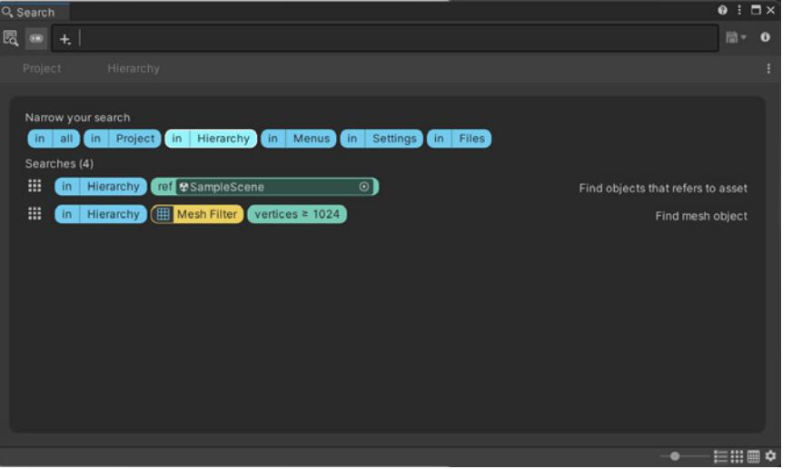

The Query Builder

<span id="page-17-0"></span>The Query builder can be activated with the builder toggle (see puzzle button next to the Search Field). Notice how the builder workflow plays well with the new Search Landing page.

#### Inspector Debug Mode

You can toggle each GameObject's Inspector between Normal and Debug mode. Click the **More Items** ( ⁝ ) button to open the context menu and choose the desired mode.

Debug Mode only shows the selected component's properties and their values. It also displays private variables, although you cannot edit them.

| Inspector                      | B          |               |        |       |                                                  |
|--------------------------------|------------|---------------|--------|-------|--------------------------------------------------|
| >                              | GameObject |               |        | Stati | Lock                                             |
| Tag Untagged                   | >          | Layer Default |        |       | V Normal                                         |
|                                |            |               |        |       | Debug                                            |
| 1<br>Transform<br>?<br>-1<br>> |            |               |        |       |                                                  |
| Position                       | X 0        | Y O           | Z<br>0 |       | Expand All Components<br>Collapse All Components |
| Rotation                       | X 0        | Y O           | Z<br>O |       |                                                  |
| Scale                          | X 1        | Y 1           | Z      |       | Ping                                             |

Inspector Debug mode

#### <span id="page-18-0"></span>10 small workflow tips

These 10 small but powerful enhancements will help you further speed things up in the Editor.

1. Cut and paste GameObjects in the Hierarchy window. You can also **Paste As Child** from the context menu.


Paste As Child

- 2. Use the **F** shortcut to frame the selected object in Scene View. This now handles more object types and does a better job of framing them. In Play Mode, press **Shift + F** to lock onto a selected GameObject that is moving.
- 3. Display UVs, normals, tangents, and other Mesh information in the Inspector preview.


The Inspector preview

4. See improved Inspector previews for 3D textures, such as volumetric render, 3D texture slices, or a signed distance field.

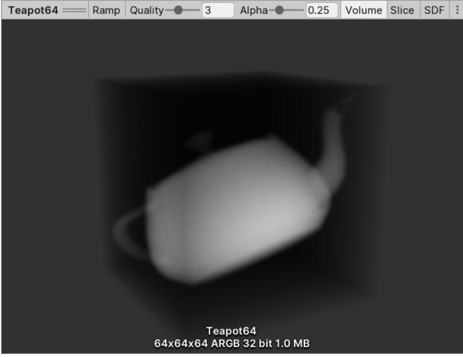

A volumetric render

5. Use the Layers menu to toggle off the visibility of any Layers (such as UI) that may obscure your Scene view. Lock a Layer to avoid changing its state accidentally.

| Layers               |        |
|----------------------|--------|
| Everything           | O      |
| Nothing              | D      |
| 0: Default           | B<br>O |
| 1: TransparentFX     | B<br>0 |
| 2: Ignore Raycast    | B<br>0 |
| 4: Water             | a<br>6 |
| 5: Ul                | a<br>0 |
| 8: PostProcessing    | 3<br>O |
| 9: Not in Reflection | B<br>0 |
| Edit Layers          |        |

Toggle and edit Layers

6. If you frequently select the same objects in your scene, use the hotkey combos under **Edit > Selection** to quickly save or load a selection set.

| 151<br>Selection<br>Load Selection 1<br>个器1<br>D<br>Load Selection 2<br>个第2<br>Project Settings<br>个第3<br>Load Selection 3<br>Load Selection 4<br>个第4<br>Clear All PlayerPrefs<br>Load Selection 5<br>个第5<br>Render Pipeline<br>Load Selection 6<br>1 %6<br>Load Selection 7<br>心器7<br>Graphics Tier<br>Load Selection 8<br>0 %8<br>Load Selection 9<br>0 % 9<br>Grid and Snap Settings<br>Load Selection 0<br>Save Selection 1<br>Save Selection 2<br>Save Selection 3<br>Save Selection 4<br>Save Selection 5<br>Save Selection 6<br>Save Selection 7<br>Save Selection 8 | Sign in<br>Sign out |       |  |
|-----------------------------------------------------------------------------------------------------------------------------------------------------------------------------------------------------------------------------------------------------------------------------------------------------------------------------------------------------------------------------------------------------------------------------------------------------------------------------------------------------------------------------------------------------------------------------|---------------------|-------|--|
|                                                                                                                                                                                                                                                                                                                                                                                                                                                                                                                                                                             |                     |       |  |
|                                                                                                                                                                                                                                                                                                                                                                                                                                                                                                                                                                             |                     |       |  |
|                                                                                                                                                                                                                                                                                                                                                                                                                                                                                                                                                                             |                     |       |  |
|                                                                                                                                                                                                                                                                                                                                                                                                                                                                                                                                                                             |                     |       |  |
|                                                                                                                                                                                                                                                                                                                                                                                                                                                                                                                                                                             |                     |       |  |
|                                                                                                                                                                                                                                                                                                                                                                                                                                                                                                                                                                             |                     |       |  |
|                                                                                                                                                                                                                                                                                                                                                                                                                                                                                                                                                                             |                     |       |  |
|                                                                                                                                                                                                                                                                                                                                                                                                                                                                                                                                                                             |                     |       |  |
|                                                                                                                                                                                                                                                                                                                                                                                                                                                                                                                                                                             |                     |       |  |
|                                                                                                                                                                                                                                                                                                                                                                                                                                                                                                                                                                             |                     |       |  |
|                                                                                                                                                                                                                                                                                                                                                                                                                                                                                                                                                                             |                     | 个第0   |  |
|                                                                                                                                                                                                                                                                                                                                                                                                                                                                                                                                                                             |                     | 7 % 1 |  |
|                                                                                                                                                                                                                                                                                                                                                                                                                                                                                                                                                                             |                     | 1. #2 |  |
|                                                                                                                                                                                                                                                                                                                                                                                                                                                                                                                                                                             |                     | 1. #3 |  |
|                                                                                                                                                                                                                                                                                                                                                                                                                                                                                                                                                                             |                     | 7882  |  |
|                                                                                                                                                                                                                                                                                                                                                                                                                                                                                                                                                                             |                     | 7-85  |  |
|                                                                                                                                                                                                                                                                                                                                                                                                                                                                                                                                                                             |                     | 7-86  |  |
|                                                                                                                                                                                                                                                                                                                                                                                                                                                                                                                                                                             |                     | 787   |  |
|                                                                                                                                                                                                                                                                                                                                                                                                                                                                                                                                                                             |                     | 1. #8 |  |
| Save Selection 9                                                                                                                                                                                                                                                                                                                                                                                                                                                                                                                                                            |                     | 6881  |  |
| Save Selection 0                                                                                                                                                                                                                                                                                                                                                                                                                                                                                                                                                            |                     | 7-80  |  |

Load and Save Selections

7. Modify the **Numbering Scheme** for duplicate objects in **Project Settings > Editor**.

Define options for the naming here as well as the padding and spacing of the instance number.


Numbering Scheme

8. Use the **EditorOnly** tag to designate GameObjects that will not appear in a build of the application.

| Untagged<br>>  |  |
|----------------|--|
| Respawn        |  |
| Finish         |  |
| EditorOnly     |  |
| MainCamera     |  |
| Player         |  |
| GameController |  |
|                |  |
| Add Tag        |  |

EditorOnly

9. Change colors in the Editor via **Unity > Preferences > Colors** to find certain UI elements or objects more quickly in Editor. Adjust the Playmode tint to remind yourself when Play Mode is active, so you don't lose any changes you intended to save on exit.

|  |                                                           | Preferences            |   |  |
|--|-----------------------------------------------------------|------------------------|---|--|
|  | Preferences                                               |                        |   |  |
|  |                                                           | Q                      |   |  |
|  | General<br>2D                                             | Colors                 |   |  |
|  | ▼ Analysis<br>Profiler<br>Cache Server (global)<br>Colors | Animation              |   |  |
|  |                                                           | Property Animated      | 8 |  |
|  |                                                           | Property Candidate     | A |  |
|  | Core Render Pipeline                                      | Property Recorded      | 8 |  |
|  | External Tools                                            | General                |   |  |
|  | GI Cache                                                  | Playmode tint          | A |  |
|  | Scene View<br>Search Service<br>Shader Graph<br>Timeline  | Scene                  |   |  |
|  |                                                           | Background             | A |  |
|  |                                                           | Background for Prefabs |   |  |
|  |                                                           | Center Axis            | 8 |  |

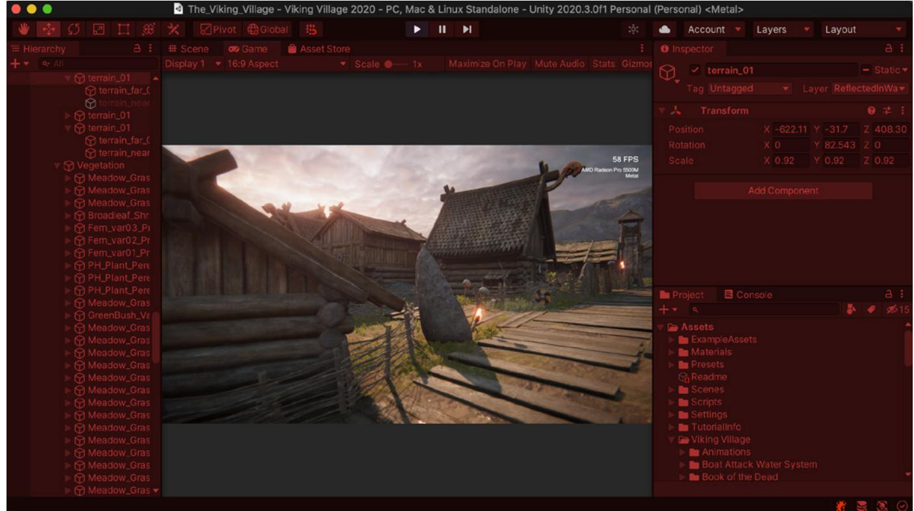

Playmode tint

In the event that you make a change in Play Mode that you want to keep, use the **More Items** ( ⁝ ) button. Copy the component or transform values while playing, then paste from the clipboard upon exiting Play Mode. Alternatively, if you have multiple component changes, drag out a temporary Prefab to save your work there.

10. When you set up cameras, use **GameObject > Align With View** to line up your Game camera with the Scene camera. Or, if you're matching the other way around, use **Align View to Selected** to align the Scene camera with another camera in the Hierarchy.


Align With View

#### **More resources**

- [Advanced Editor scripting hacks to save you time: Part I](https://blog.unity.com/engine-platform/advanced-editor-scripting-hacks-to-save-you-time-part-1)
- [Advanced Editor scripting hacks to save you time: Part II](https://blog.unity.com/engine-platform/advanced-editor-scripting-hacks-to-save-you-time-part-2)
- [Speed up your productivity with the Unity Hub](https://blog.unity.com/engine-platform/speed-up-your-productivity-with-the-unity-hub)

## <span id="page-23-0"></span>Artist workflows

There are many ways that 2D and 3D artists, animators, and level designers can save time in Unity and work more efficiently with in-context iteration. In Unity 2022 LTS specifically, there are smoother workflows for customizing the Editor with UI Toolkit, advanced new options for visual quality and performance with HDRP and URP, improvements to 2D tools, and more. See the [Unity 2022](https://unity.com/releases/editor/whats-new/2022.1.0)  [release notes](https://unity.com/releases/editor/whats-new/2022.1.0) for a comprehensive list of new features, improvements, and fixes.


The 2D art for Happy Harvest

<span id="page-24-0"></span>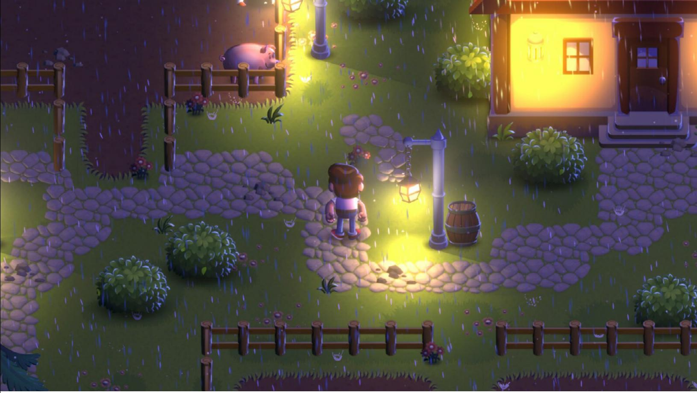

*Happy Harvest*, [now available](https://assetstore.unity.com/packages/essentials/tutorial-projects/happy-harvest-2d-sample-project-259218) on the Unity Asset Store, harnesses the latest capabilities for creating 2D lights, shadows, and special effects with URP in [Unity 2022 LTS](https://blog.unity.com/engine-platform/unity-2022-lts-is-coming-in-june).

#### 2D artist tips

Many of the 2D tips and improvements outlined here are used in [Happy Harvest,](https://assetstore.unity.com/packages/essentials/tutorial-projects/happy-harvest-2d-sample-project-259218) a demo of a 2D top-down farming simulation game that shows what's possible with 2D lights, shadow effects, skeletal animation, sprite libraries, visual effects, and more in Unity 2022 LTS.

A series of in-depth articles are available to read alongside the demo. These articles explain how to create the 2D visuals in *Happy Harvest* so you can add them to your own projects:

- 1. [2D light and shadow techniques in the Universal Render Pipeline](https://unity.com/how-to/2d-light-shadow-techniques-in-the-universal-render-pipeline)
- 2. [How to animate 2D characters in Unity 2022 LTS](https://unity.com/how-to/2d-characters-and-animation-unity-2022-lts)
- 3. [How to create art and gameplay with 2D tilemaps](https://unity.com/how-to/create-art-and-gameplay-2d-tilemaps-unity)
- 4. [2D special effects with the VFX Graph and Shader Graph](https://unity.com/how-to/2d-special-effects-vfx-graph-shader-graph)

Finally, you can explore many more 2D art and optimization techniques in the e-book *[2D game art, animation, and lighting for artists](https://unity.com/resources/2d-game-art-animation-lighting-for-artists-ebook?isGated=false).*

1. A 2D project uses Sprites to create its visuals. These potentially contain many Texture assets and may thus require many draw calls. To optimize resources, use a **Sprite Atlas** (**Asset > Create > Sprite Atlas**) rather than rendering individual Sprites and Textures.

[Sprite Atlas V2](https://docs.unity3d.com/Manual/SpriteAtlasV2.html) is out of preview in Unity 2022 LTS, fully working in the Editor, allowing users to experience the benefits of atlassing sprites without entering Play mode or making a build. It also supports [Unity Accelerator](https://docs.unity3d.com/Manual/UnityAccelerator.html), and, as of 2021.2, it provides full support for folders as packable objects. Sprite Atlas V2 uses the functionalities exposed by [AssetDatabase V2](https://docs.unity3d.com/2022.3/Documentation/Manual/AssetDatabase.html) (ADBV2), such as [Cache Server](https://docs.unity3d.com/Manual/UnityAccelerator.html) support.


A Sprite Atlas packs several Sprites into a single combined Texture.

Add Sprites into the [Objects for Packing list,](https://docs.unity3d.com/Manual/SpriteAtlasWorkflow.html#objectlist?) and enable [include in build](https://docs.unity3d.com/Manual/SpriteAtlasWorkflow.html#inclbuild?) to include your Sprites with the project. Use the [Packing options](https://docs.unity3d.com/Manual/SpriteAtlasWorkflow.html#Optimized?) to determine how closely the Sprites can be laid out in the atlas and whether they can be rotated. Once the Textures are consolidated, Unity can issue a single draw call to access the packed Textures with a smaller performance overhead.

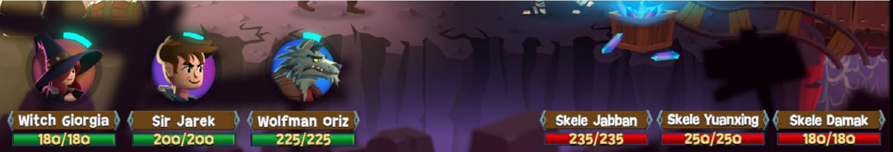

In Unity's UI system, atlasing and the GameObject structure matter for batching.

2. A SpriteAtlas can reduce draw calls if you organize the UI layout correctly. Unity scans the GameObjects' Hierarchy top to bottom in order to batch objects that use the same texture and material. See our guide on [Unity UI](https://unity.com/how-to/unity-ui-optimization-tips)  [optimization](https://unity.com/how-to/unity-ui-optimization-tips) tips for more best practices.

The [SpriteAtlas AP](https://docs.unity3d.com/ScriptReference/U2D.SpriteAtlas.html?)I provides additional control at runtime. You can also create a [Variant Sprite Atlas](https://docs.unity3d.com/Manual/VariantSpriteAtlas.html?) or prepare the Sprite Atlases for an [alternate](https://docs.unity3d.com/Manual/SpriteAtlasDistribution.html?)  [form of distribution](https://docs.unity3d.com/Manual/SpriteAtlasDistribution.html?) with [Late Binding i](https://docs.unity3d.com/Manual/LateBinding.html?)n a script.

3. Th[e 2D Pixel Perfect Package](https://docs.unity3d.com/Packages/com.unity.2d.pixel-perfect@5.0/manual/index.html) contains a Pixel Perfect Camera that ensures your pixel art remains crisp and clear at different resolutions, so you can avoid manual scaling of your art assets.

| ▼ 9 Pixel Perfect Camera                                                                                                                                        |     |      |       | 8 花 : |   |
|-----------------------------------------------------------------------------------------------------------------------------------------------------------------|-----|------|-------|-------|---|
| URP Pixel Perfect Camera requires a camera<br>using a 2D Renderer. Some features, such<br>as Upscale Render Texture, are not<br>supported with other Renderers. |     |      |       |       |   |
| Assets Pixels Per Un 100                                                                                                                                        |     |      |       |       |   |
| Reference Resolutio X 320                                                                                                                                       |     |      | Y 180 |       |   |
| Crop Frame                                                                                                                                                      |     | None |       |       | V |
| Grid Snapping                                                                                                                                                   |     | None |       |       | V |
| Current Pixel Ratio                                                                                                                                             | 1:1 |      |       |       |   |

Pixel Perfect Camera

Read how SouthPAW Games created their first pixel art game using Unity's 2D tools in **[2D Pixel Perfect for a crisp conquest in](https://blog.unity.com/games/2d-pixel-perfect-for-a-crisp-conquest-in-skul-the-hero-slayer)** *Skul: The Hero Slayer***.**


The 2D Pixel Perfect Camera

4. Use the [PSD Importer Package](https://docs.unity3d.com/Packages/com.unity.2d.psdimporter@8.0/manual/index.html) if you want to work with Photoshop file assets, both .PSD and .PSB files. Skip exporting separate sprites, and import a **.PSD** or **.PSB** file. This allows you to import multiple sprites from the various layers and generate a Sprite Sheet or 2D Character Rig. See [this guide](https://blog.unity.com/engine-platform/how-to-speed-up-2d-art-workflows-with-2d-psd-importer) on speeding up your 2D workflows with the PSD Importer.

In Unity 2022 LTS, you can control which layers to import from a Photoshop file by selecting them from a tab in the PSD Importer Inspector. You can also set padding between sprites in mosaic mode.


The 2D PSD Importer is available in the Package Manager.

5. Use [Tilemaps](https://docs.unity3d.com/2022.3/Documentation/Manual/class-Tilemap.html?) to create large grid-based worlds, including hexagonal and isometric versions, optimized for size and performance. Get more tips from [How to create art and gameplay with 2D tilemaps.](https://unity.com/how-to/create-art-and-gameplay-2d-tilemaps-unity)

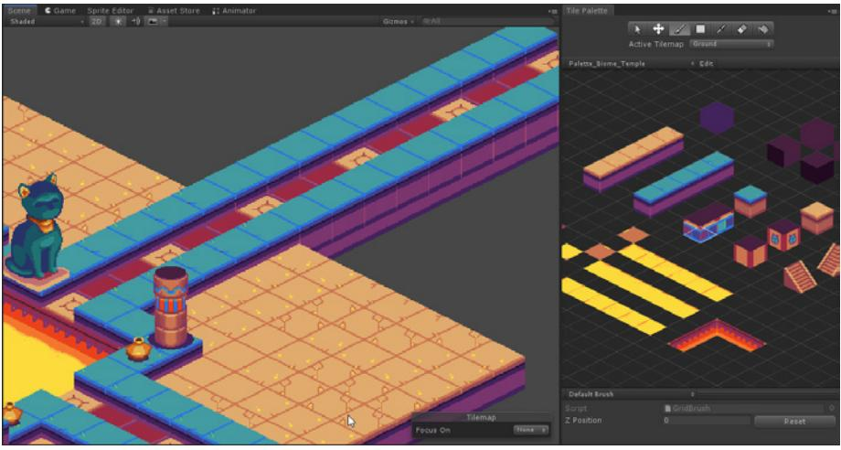

Tilemaps can describe isometric or other grid-like environments.

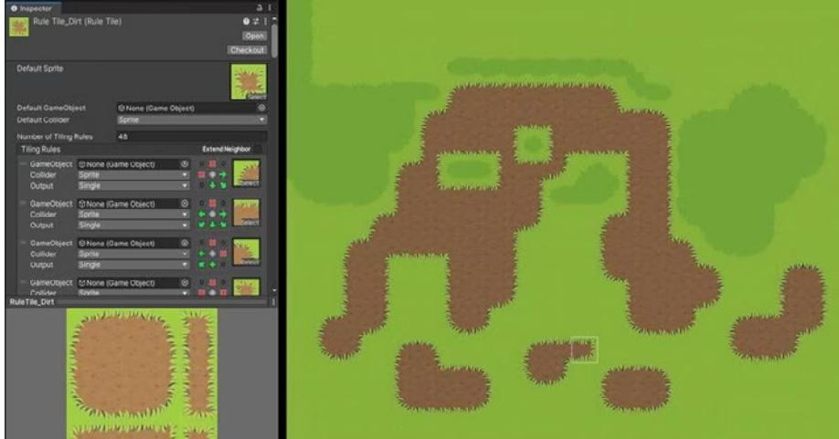

Setting up rule tiles in *Happy Harvest*

6. Create smooth [2D skeletal animation](https://docs.unity3d.com/Packages/com.unity.2d.animation@9.1/manual/index.html) with rigging, tessellation, and bone creation. 2D Inverse Kinematics (IK) simplifies animation, calculating how your 2D bones can reach their target destination. Learn more in [How to](https://unity.com/how-to/2d-characters-and-animation-unity-2022-lts)  [animate 2D characters in Unity 2022 LTS.](https://unity.com/how-to/2d-characters-and-animation-unity-2022-lts)

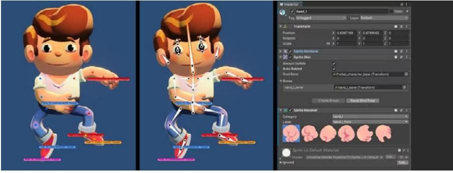

Animating the main character in *Happy Harvest* with 2D IK Solvers: The left image shows modifying the position of the bones and rotation, while the center and right images show changing the sprite for the hand with Sprite Resolver.

7. Enhance your visuals with [2D Lights.](https://docs.unity3d.com/Packages/com.unity.render-pipelines.universal@14.0/manual/Lights-2D-intro.html) Lights feature easy-to-configure parameters like light colors, intensity, fall-off, and blending effects. Get additional tips on 2D lighting from [this article](https://unity.com/how-to/use-2d-lights-unity-set-mood?) by Martin Reinmann of Odd Bug Studio, and [this page](https://unity.com/how-to/2d-light-shadow-techniques-in-the-universal-render-pipeline) on 2D light and shadow techniques in the Universal Render Pipeline.


Using a sprite with a halo around a hanging lamp

8. [2D Sprite Shape](https://docs.unity3d.com/Packages/com.unity.2d.spriteshape@9.0/manual/index.html) gives you the freedom to create rich free-form 2D environments with a visual and intuitive workflow. It tiles Sprites along a shape's outline, automatically deforming and swapping them based on the outline angle.

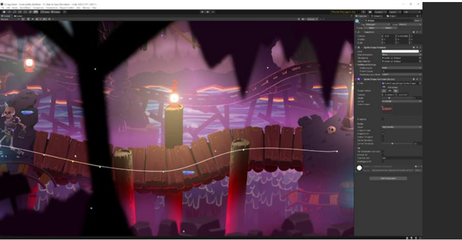

One example of how 2D Sprite Shape is used in the latest 2D sample project

Sort your [Sprites](https://docs.unity3d.com/Manual/2DSorting.html?) based on your preferred direction. This can be helpful if you have a number of Sprites within the same layer and sorting order (imagine a card game where the individual cards overlap a bit).

In the built-in render pipeline, look in **Edit > Project Settings > Graphics**. Choose **Custom Axis** for the **Transparency Sort Mode**. For example, use (0, 1, 0) for the **Transparency Sort Axis** to sort along the Y axis from top to bottom.

In the Universal Render Pipeline, set the **[Camera.transparencySortMode](https://docs.unity3d.com/ScriptReference/Camera-transparencySortMode.html?)** to **TransparencySortMode.CustomAxis**, then set your axis using **[Camera.](https://docs.unity3d.com/ScriptReference/Camera-transparencySortAxis.html?) [transparencySortAxis](https://docs.unity3d.com/ScriptReference/Camera-transparencySortAxis.html?)**.


Transparency Sort Mode and Sort Axis

9. Need custom shaders? Shader Graph includes two MasterNodes designed for 2D: **Sprite Lit** and **Sprite Unlit**. Create [2D shaders,](https://docs.unity3d.com/Packages/com.unity.render-pipelines.universal@14.0/manual/ShaderGraph.html) and enhance your 2D project visually. In Unity 2022 LTS, VFX Graph supports 2D. Add your 2D-based Shader Graphs in your graph Output and leverage the power of the GPU to render millions of particles.


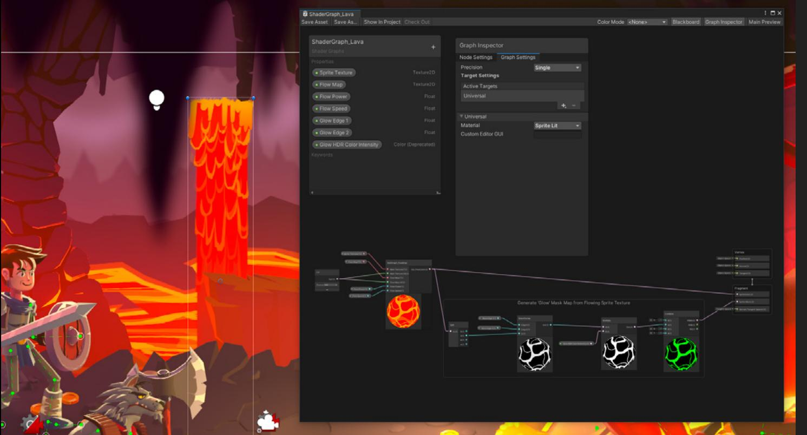

Shader Graph example from *Dragon Crashers*

10. Avoid overdraw to improve performance. Switch the **Mesh Type** to **Tight** in the [Import Settings](https://docs.unity3d.com/Manual/class-TextureImporter.html?) for each Sprite. Merge overlapping graphics in a single Sprite whenever possible, and try to disable Sprites that could be in a background layer with no use in the game. This reduces the overdraw area and potential overlap with neighboring Sprites.


Reduce overdraw between Sprites

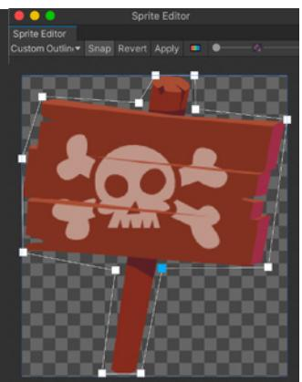

11. You can also consider defining a [custom](https://docs.unity3d.com/Manual/SpriteOutlineEditor.html?)  [outline](https://docs.unity3d.com/Manual/SpriteOutlineEditor.html?) around each Sprite using the [2D](https://docs.unity3d.com/Manual/SpriteEditor.html?)  [Sprite Editor](https://docs.unity3d.com/Manual/SpriteEditor.html?) to minimize the unused areas. In 2022 LTS the Sprite Library Editor provides a more efficient way to manage Sprite Libraries, with improved performance for larger sets of content.

The Sprite Editor with a custom outline

<span id="page-31-0"></span>12. [Sprite Swap](https://docs.unity3d.com/Packages/com.unity.2d.animation@9.0/manual/SpriteSwapIntro.html) is a feature that enables you to change a GameObject's rendered Sprite at runtime. This has a number of uses, such as easily creating multiple characters which [share a skeleton](https://docs.unity3d.com/Packages/com.unity.2d.animation@9.1/manual/ex-skeleton-sharing.html) (requires the PSD Importer package) or [reuse existing bone and Mesh data](https://docs.unity3d.com/Packages/com.unity.2d.animation@9.1/manual/SkinEdToolsShortcuts.html) while looking visually different.

Unity 2022 LTS brings improvements to the Sprite Swap workflows with streamlined Sprite Swap keyframing in the Animation window.

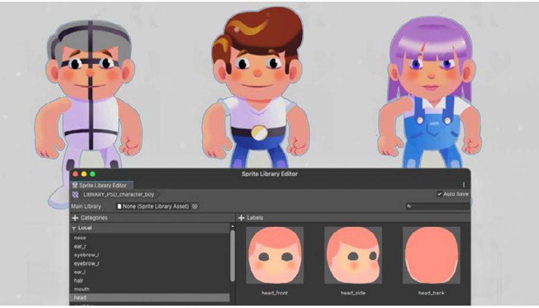

Swapping sprite libraries from the initial dummy character in *Happy Harvest* to a male and female variation that share the same categories and labels.

13. Other improvements for 2D animators in Unity 2022 LTS are Sprite deformation and IK Solvers in Animation preview windows. There is also an added Character Pivot tool in the Skinning Editor. You can use the new asset upgrading tool to upgrade older Sprite Library Assets and Animation Clips to the latest version.

#### Pro 2D tips from the creators of *Happy Harvest*

- Draw the character in a neutral position with arms and legs straight. If parts of the body are bent, it can cause issues when you're animating.
- Make the resolution a little higher than your game's Pixels per Unit ([PPU\)](https://blog.unity.com/engine-platform/choosing-the-resolution-of-your-2d-art-assets) suggests. A resolution might look good at rest, but rotating and stretching images can cause pixelation.
- If you're using 2D lighting extensively in your game and want to make the most of normal maps, don't paint the light and shadow onto your sprite. Instead, paint nondirectional shadows. This technique is called ambient occlusion. Your sprite will look better, but you'll want to avoid using any directional light like sunlight.
- Body part layers swapped using the Sprite Swap feature should be grouped accordingly. For example, all layers with mouth positions should be placed in a group called "mouth" in the image-editing app.

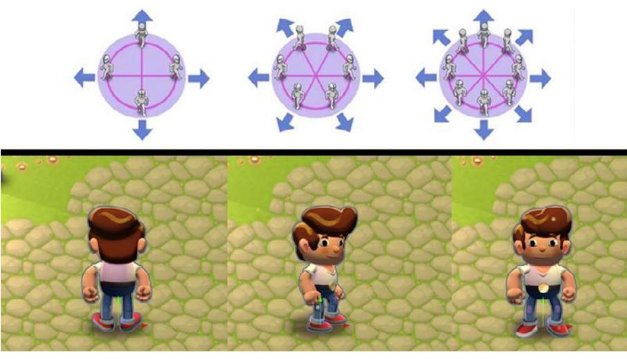

There are a number of possibilities for character rotation in a 2D top-down or isometric game. The bottom image shows animations of the main character facing three different directions.

- Often, a simple setup with 2D IK will work well for a decorative element. That's what was done for the pig prefab from *Happy Harvest*. Another example of a simple background animation is the swinging movement of the street lamps in *Happy Harvest*, that's achieved with an animation clip that plays in a loop and only changes the rotation of the sprite over time, without the need for rigging.
- Flipbook, or frame-by-frame, animation is a fast method for animating minor background characters with less overhead because it involves fewer frames. It's also well suited to the water splash effect.
- In *Happy Harvest*, the water effect and the breeze moving the bushes and trees are special effects created with the Shader Graph and VFX Graph.


Animating elements with different techniques, including simple animations, frame-by-frame, and effects created with the Shader Graph and VFX Graph

- Secondary Textures: Mask maps can be used to control where lights can affect a sprite. Mask maps help polish your game by enabling you to add details to your visuals. They're also used by the 2D Light Blend Styles.
- Lights and normal maps are used everywhere in *Happy Harvest* to create the illusion of volume. You can use normal maps with Spot, Point, and Freeform lights. Remember that you need to enable normal maps in the light object to use them in the sprites (two quality settings are available: Fast and Accurate).
- By default, 2D lights produce light by adding RGB values to the affected pixels. The higher the RGB values, the lighter the color is. However, if you change the Blend Style to Multiply, those RGB values are subtracted from the affected pixels, resulting in a darker color that simulates a shadow. You can then adjust these simulated shadows, also called negative lighting, via the same controls for lighter 2D lights.
- A quick and easy way to fake shadows is with a blob shadow, a blurred sprite that also uses negative lighting, which you can stretch to represent the ambient occlusion that an object produces on the ground.

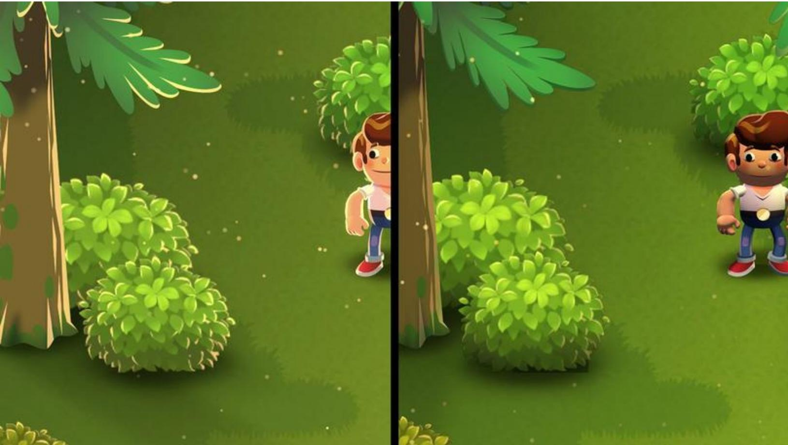

The bushes in *Happy Harvest* appear to have depth thanks to normal maps (enabled by the normal map option in the Light component).

#### Prefab workflows

Prefabs allow fully configured GameObjects to be saved in the project for reuse. The current workflow with Prefabs lets you build your scenes flexibly and efficiently.

<span id="page-34-0"></span>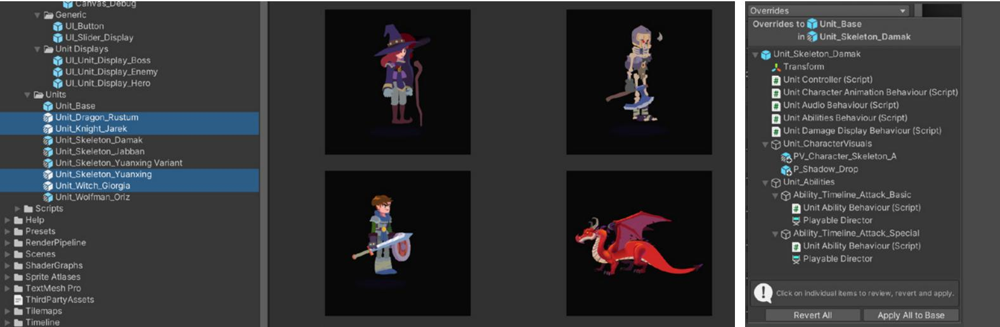

In *Dragon Crashers*, each unit overrides the base unit. The Overrides dropdown shows how the Prefab differs from the original.

> Create your Prefab as an Asset in the Project, then edit it in isolation in **Prefab mode**. Working with the Prefab by itself helps prevent applying unintended overrides. Make your changes with confidence with the background grayed out.

| 6 | Units<br>Heroes<br>Villains<br>> 2 Unit_Skeleton_Jabban<br>> Unit_Skeleton_Yuanxing<br>V / Unit_Skeleton_Damak | ><br>>                                                                   |                                                                                       |
|---|----------------------------------------------------------------------------------------------------------------|--------------------------------------------------------------------------|---------------------------------------------------------------------------------------|
|   | Unit_CharacterVisuals<br>Unit_SFX<br>> Unit_Abilities<br>Unit_DamageDisplayLocation<br>Environment<br>A        | Cut<br>Copy<br>Paste<br>Paste As Child                                   |                                                                                       |
|   | ကြပါ<br>V<br>Scene_VCams<br>A<br>Cutscenes<br>D                                                                | Rename<br>Duplicate<br>Delete                                            |                                                                                       |
|   |                                                                                                                | Select Children                                                          |                                                                                       |
|   |                                                                                                                | Set as Default Parent                                                    |                                                                                       |
|   |                                                                                                                | Prefab<br>A                                                              | Open Asset in Context                                                                 |
|   |                                                                                                                | Create Empty<br>Create Empty Parent<br>2D Object<br>3D Object<br>Effects | Open Asset in Isolation<br>Select Asset<br>Select Root<br>Unpack<br>Unpack Completely |

Edit each Prefab, either in Context or in Isolation.


Edit in Context mode to see the Prefab relative to the other objects in the Scene.

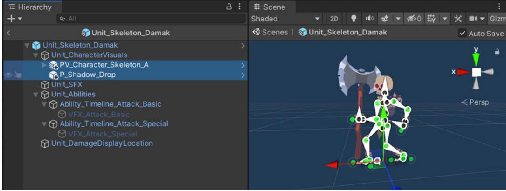

Isolate the Prefab in Prefab mode to avoid unintended overrides. Note how smaller prefabs make up this Nested Prefab.

**Nested Prefabs** allow you to parent Prefabs to one another. You can now create a larger Prefab, such as a building, composed of smaller Prefabs for the rooms and furniture. This makes it efficient to split development of your assets over a team of multiple artists and developers, who can all work on different parts of the content simultaneously.

A **Prefab Variant** allows you to derive a Prefab from other Prefabs, much like inheritance in object-oriented programming. To change the Variant, just override certain parts without worry of impacting the original. You can also remove all modifications and revert to the base Prefab at any time.

Alternatively, if you want to change all of your Variants at once, apply changes directly onto the base Prefab itself.

<span id="page-36-0"></span>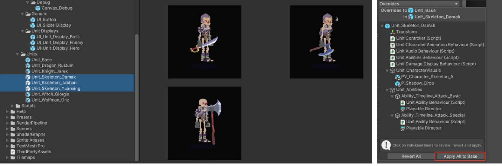

In *Dragon Crashers*, these Prefab Variants have different weapons and abilities. Use **ApplyAll to Base** to propagate changes to the

Base object or **Revert All** to undo the overrides.

See [Unity documentation](https://docs.unity3d.com/Manual/Prefabs.html) for more information about working with Prefabs.

#### Material Variants

Materials play a crucial role in rendering by determining how an object reflects or emits light. They can make an object look like metal, glass, wood, or even something abstract or magical. A material contains a reference to a shader object. If that shader object defines material properties, then the material can also contain data, such as colors or texture references.

In Unity 2022 LTS, Material Variants allow for the reuse and improved management of materials that share most surface properties.

With Material Variants, you can create templates or material prefabs. Based on a base template, you can create variants that share common properties with the template material and override only the properties that differ. If you change common and non-overridden properties in the template material, the changes automatically reflect in the variant material. You can also lock certain properties on material so they can't be overridden in the variants.


An example of Material Variants; these all share the same base material and only differ in the color property

In a more complex setup, you can create variations of a variant material. The material inheritance hierarchy promotes reusability and improves iteration speed and scalability of material authoring in your project.

#### <span id="page-37-0"></span>TextMeshPro

TextMeshPro replaces Unity's UI Text and the legacy Text Mesh. Installed via the PackageManager, [TextMeshPro](https://docs.unity3d.com/Manual/com.unity.textmeshpro.html?) uses custom shaders and advanced text rendering techniques to deliver flexible text styling and texturing.

Use TextMeshPro to get access to features like character, word, line, and paragraph spacing, kerning, justified text, links, over 30 rich text tags available, support for Multi Font and sprites, custom styles, and more.

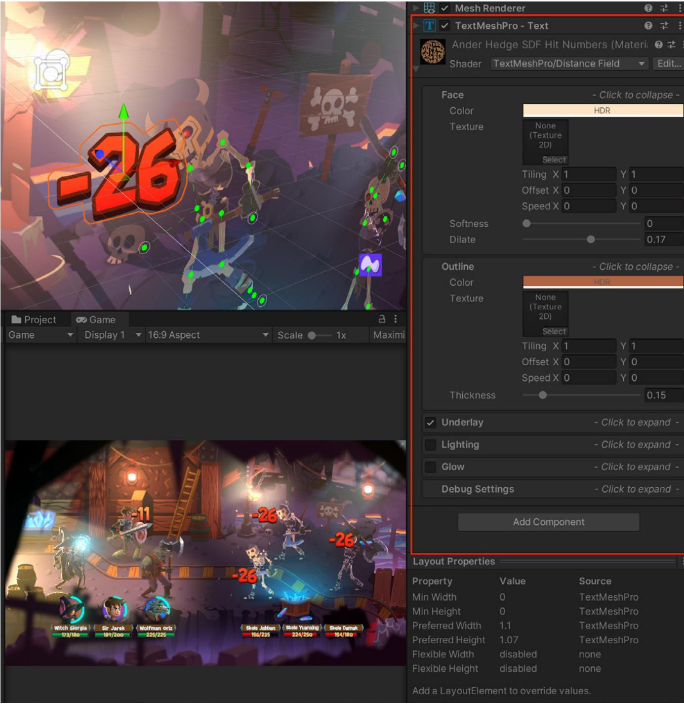

TextMeshPro example from *Dragon Crashers*

#### <span id="page-38-0"></span>Splines

The [Splines package in Unity 2022 LTS](https://docs.unity3d.com/Packages/com.unity.splines@2.5/manual/index.html) enables you to create spline paths in your game for rivers, roads, camera tracks, and other path-like visuals. Depending on the type of environment you're working on, splines can be an important component for your level designs.

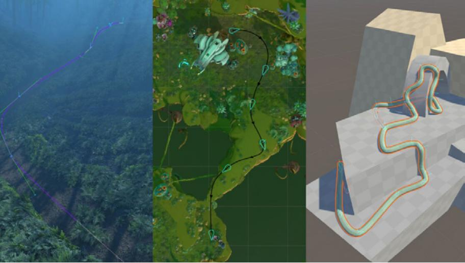

Examples of use cases for splines: A road through a forest, an animation path, tubes, or wire meshes, and you can find other samples showcasing all the possibilities in the Splines Package Manager page once it's installed.

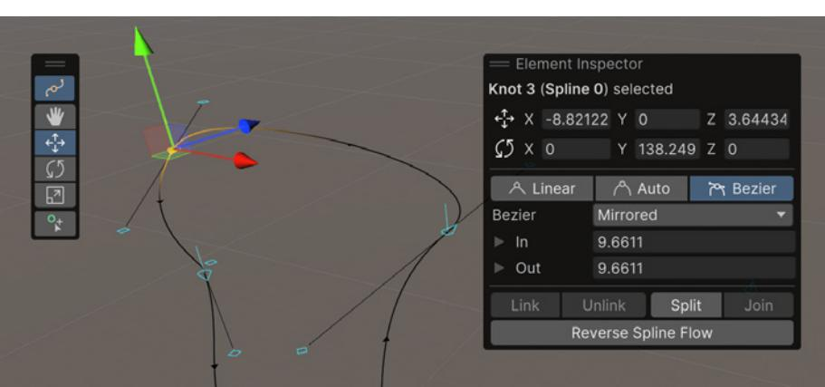

Create a new spline via **GameObject > Spline > Draw Splines Tool**. A new GameObject will be created in the Hierarchy with the Spline component attached and the tooling ready to use.

The handles and controls for splines in Unity resemble vector or 3D drawing tools from well-known DCC applications.

Once you've created a spline, both programmers and artists can use it in interesting ways. For example, programmers can read points of the spline and use them in the game logic with the [APIs.](https://docs.unity3d.com/Packages/com.unity.splines@2.5/api/index.html)

#### <span id="page-39-0"></span>Snapping

Working on a grid helps you fit your Prefabs together with less guesswork and greater consistency. Design your level so the pieces connect at scale, making it easier to rearrange and reassemble them.

If you are constructing your Scenes from modular assets, use grid planes to align your GameObjects with each other. Rather than manually typing in round numbers into the Inspector, consider letting the grid snapping tools set your Transforms more quickly and precisely.

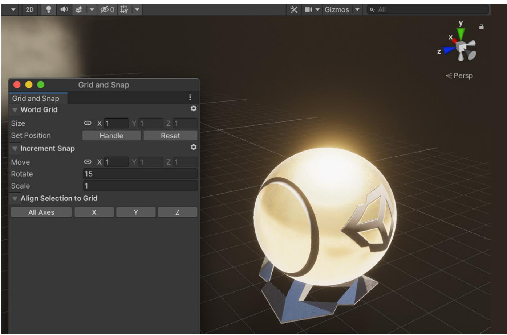

The Grid and Snap settings

Unity provides three types of snapping to help you assemble your scenes quickly:

- **World grid snapping:** Make sure the **Move** tool has the handle orientation set to **Global**. Hold **Ctrl (Windows)** or **Cmd (macOS)** to snap an object to the world grid increments set in **Edit > Grid and Snap Settings**.
- **Surface snapping:** Hold **Shift** and **Ctrl** (**Windows**) / **Cmd** (**macOS**) to snap an object to the intersection of any **Collider**.
- **Vertex snapping:** Hold down the **V** key while the Move tool is active. This moves the current GameObject to the vertex position of another mesh. Before moving, hover the mouse over one vertex of the active GameObject to make that vertex act as a pivot. **Shift-V** toggles **Vertex snapping** mode on/off.

Combine **Vertex and Surface snapping** for quick placement:

- Move the GameObject using **Vertex snapping** with the **V** key or **Shift-V**. Hover the cursor over a vertex as a pivot. Snap to another vertex as usual.
- Hold down the **Shift** and **Ctrl** (**Windows**) / **Cmd** (**macOS**) key combo to drag along the surface of the target Mesh.
- Release the mouse button and **V** key once the object is at the desired location.

Open the **Grid and Snap window** from either **Edit > Grid and Snap Settings** or from the grid visibility drop-down menu.

| 载<br>V         |                             |
|----------------|-----------------------------|
| Grid Axis      |                             |
| X<br>Y<br>1    | Reset                       |
| Z              | Edit Grid and Snap Settings |
| Grid Settings  |                             |
| 0.5<br>Opacity |                             |

Grid and Snap settings

These grid snapping shortcuts are created by default.

| Action                  | Default Shortcut      |
|-------------------------|-----------------------|
|                         | Ctrl + ] (Windows) or |
| Increase Grid Size      | Cmd + ] (macOS)       |
|                         | Ctrl + [ (Windows) or |
| Decrease Grid Size      | Cmd + [ (macOS)       |
| Nudge Grid Backward     | Shift + [             |
| Nudge Grid Forward      | Shift + ]             |
|                         | Ctrl + \ (Windows) or |
| Align Selection to Grid | Cmd + \ (macOS)       |

Need even more control? Consider using the [ProGrids](https://docs.unity3d.com/Packages/com.unity.progrids@3.0/manual/grids.html?) package for even finer control of your snapping and grid planes.

<span id="page-41-0"></span>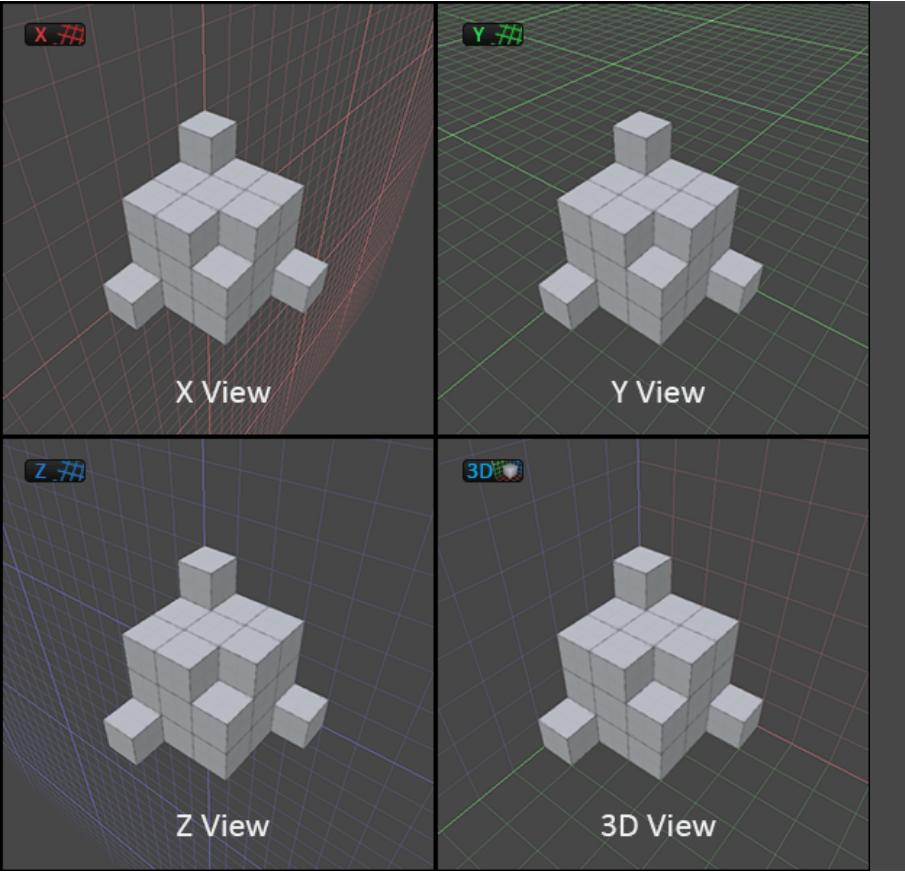

ProGrids

#### Animation workflow

You can animate just about any property in Unity without writing a single line of code using the **Animation Window** (**Window > Animation > Animation**). In addition to modifying movement, you can even drive parameters defined in your custom scripts.

Create Animation Clips here, or work in a third-party DCC package of your choice (Autodesk® Maya®, Blender, etc). Think of each clip as an individual unit of motion.


| 0.0                                            |        |      |       |      | Animation |      |
|------------------------------------------------|--------|------|-------|------|-----------|------|
|                                                |        |      |       |      |           |      |
| Animation                                      |        |      |       |      |           |      |
| Preview 0 HA 14 ▶<br>A 24                      | 0      | 0:00 | 10:30 | 1:00 | 11:30     | 2:00 |
| AnimClip_Character_Dragon_Idle ▼               | �      | 114  |       |      |           |      |
| > ↓ Leg Front R LimbSolver2D_Target : Position |        |      |       |      |           | �    |
| > Neck CCDSolver2D_Target : Position           |        |      | •     | �    |           | ◆    |
| > J. hip : Position                            |        |      |       |      |           | �    |
| ▼ J. hip : Rotation                            |        |      |       |      |           |      |
| J Rotation.x<br>0                              |        |      |       |      |           |      |
| & Rotation.y<br>0                              |        |      |       |      |           | �    |
| J. Rotation.z                                  | 91.121 |      |       |      |           | ◆    |
| > Jabdomen : Position                          |        |      |       |      |           | �    |
| > Jabdomen : Rotation                          |        |      |       | �    |           | ◆    |
| Jochest : Position<br>4                        |        |      |       |      |           | �    |
| J chest : Rotation                             |        |      |       |      |           | ◆    |
| > Aneck01 : Position                           |        |      |       |      |           |      |
| J.neck01 : Rotation<br>4                       |        |      |       |      |           |      |
| > Aneck02 : Position                           |        |      |       |      |           |      |
| > > neck02 : Rotation                          |        |      |       |      |           | ◆    |
| > < neck03 : Position                          |        |      |       |      |           |      |
| Jneck03 : Rotation<br>b                        |        |      |       |      |           | ◆    |
| > J-neck04 : Position                          |        |      |       |      |           |      |
| > < neck04 : Rotation                          |        |      |       |      |           | ◆    |
| > Aneck05 : Position                           |        |      |       |      |           |      |
| Aneck05 : Rotation                             |        |      |       |      |           | ◆    |
| > head : Position                              |        |      |       |      |           | ◆    |
| > Ahead : Rotation                             |        |      |       |      |           | �    |
| Dopesheet                                      | Curves |      |       |      |           |      |

The Animation window can represent the same animation data as curves or a dopesheet.

Edit the AnimationClip Asset within the window in either **Dopesheet** or **Curve** mode. Use **K** or **C** shortcuts, respectively, to toggle between the two. Use standard shortcuts to frame all keyframes (**A**) or frame selected keyframes (**F**).


The AnimatorController links the Animation Clips in a visual graph.

Once you have several Animation Clips for your GameObject, the AnimatorController acts as a state machine to create a flowchart-like graph between them.

This allows artists to produce sophisticated animation with greater independence from programmers. If you're using a 2D or 3D rig, you can animate its body parts with different logic. Take advantage of the layering and masking features for greater control. Prototype your motions in a visual programming tool to fine-tune any transitions or interactions between your clips.

Extend this further using the [Animation Rigging](https://docs.unity3d.com/Packages/com.unity.animation.rigging@1.3/manual/index.html) package. This package provides a library of rig and inverse kinematic constraints that can create procedural motion. Animated skeletons can thus interact with the environment with "runtime rigging," or physics-based constraints can add dynamic secondary motion.

<span id="page-43-0"></span>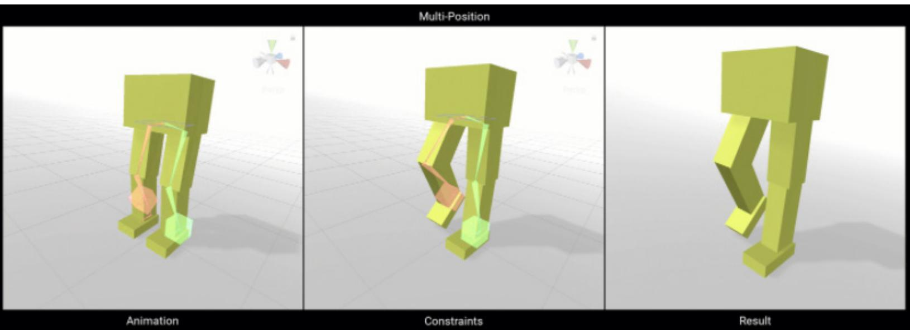

Constraints can modify your animation at runtime.


Refer to the manual pages about [AnimationClips](https://docs.unity3d.com/Manual/AnimationClips.html?) and [AnimationController](https://docs.unity3d.com/Manual/AnimatorControllers.html?) for more information about their usage. Read [Unity's evolving best practices](https://unity.com/how-to/advanced-programming-and-code-architecture?) for more about optimizing your animation components.

#### <span id="page-44-0"></span>Custom gizmos and icons

Gizmos are small overlay graphics associated with your GameObjects. Use them to navigate the viewport or locate specific objects.

Modify the icons for a GameObject using the **Select Icon** menu. Choose **Other** to define your own icon.

| O Inspector         |                     | a :            |
|---------------------|---------------------|----------------|
| ><br>Cube           |                     | Static ▼       |
|                     | Layer Default<br>>  | >              |
| Select Icon<br>None | Overrides<br>Select | A              |
|                     |                     | 0<br>th<br>. C |
| . . 000             | X 0<br>YO           | ZO             |
| ���������           | X 0<br>Y O          | ZO             |
| Other               | ×1<br>Y 1           | Z 1            |

Use the drop-down in the Inspector to switch gizmos.


Select a custom gizmo using the Other… option.

You can also create gizmos with scripts and make them interactive. For example, a gizmo could help you define a volume or area of influence for a custom component.


In this example, a script changes the gizmo based on a selection.

Use the **Gizmos** dialogue in the Scene control bar to toggle specific gizmos or globally enable/disable all of them.

See [Creating Custom Gizmos for Development](https://learn.unity.com/tutorial/creating-custom-gizmos-for-development-2019-2?uv=2019.4?) for usage examples. Also, review the APIs for [Gizmos](https://docs.unity.cn/ScriptReference/Gizmos.html?) and [Handles](https://docs.unity.cn/ScriptReference/Handles.html?).

#### UI Toolkit

<span id="page-45-0"></span>

A screen shot from the Unity demo UI Toolkit Sample – *Dragon Crashers*, available on the Asset Store

UI Toolkit is tailored for maximum performance and reusability, with workflows and authoring tools inspired by standard web technologies. UI designers and artists will find it familiar if they already have experience designing web pages.

While UI Toolkit is intended to become the recommended system for UI development, it does not include some of the features supported by Unity UI. This makes the latter system a more appropriate choice for certain use cases and legacy projects. See [Comparison of UI systems in Unity](https://docs.unity3d.com/Manual/UI-system-compare.html?) for more information.

#### **Learn in-depth with the UI Toolkit e-book and sample project**

We recommend that you download the e-book *[User interface design and](https://unity.com/resources/user-interface-design-and-implementation-in-unity?isgated=false)  [implementation in Unity](https://unity.com/resources/user-interface-design-and-implementation-in-unity?isgated=false)* to get in-depth instruction in how to create UI with UI Toolkit across a wide range of devices.

A sample project accompanies the e-book. *[UI Toolkit Sample – Dragon Crashers](https://assetstore.unity.com/packages/essentials/tutorial-projects/ui-toolkit-sample-dragon-crashers-231178)*  is available in the Unity Asset Store. The UI Toolkit sample demonstrates how you can leverage UI Toolkit for your own applications. This demo involves a fullfeatured interface over a slice of the 2D project *Dragon Crashers,* a mini-RPG, using the Unity 2021 LTS UI Toolkit workflow at runtime.

#### <span id="page-46-0"></span>Progressive Lightmapper

Lightmapping allows you to precalculate both direct and indirect lighting, then store the result in a Texture called a lightmap for later use. Unity offers a number of Global Illumination (GI) techniques to produce high-quality lighting and shadows. Though lightmapped geometry is performant at runtime, baking a lightmap has historically been expensive.


The final scene with lightmaps applied.


The same scene without lightmapping.

The [Progressive Lightmapper](https://docs.unity3d.com/Manual/progressive-lightmapper.html?) is a fast path tracer that produces a result quickly, then refines the render over time. You can thus interrupt the process to make changes without waiting for the final bake to complete, allowing you to iterate more rapidly. Here are some tips to speed up your lightmapping:

- Enable **Prioritize View** so the Progressive Lightmapper works on texels currently visible in the Scene view first before changing anything outside of view.
- Reduce unnecessary **Samples** (Direct and Indirect Samples) and **Bounces** (two is usually sufficient; only increase if necessary).
- Optimize the **Lightmap Resolution** and texel count for your lighting needs. The number of texels represents how much work your lightmapper needs to do. Because lightmaps are 2D textures, doubling the lightmap resolution quadruples the amount of work.
- Reduce texels on hidden surfaces, small or thin objects, or anything where lightmapping won't make much impact. Each MeshRenderer contributing to Global Illumination has a **Scale in Lightmap** option to reduce its relative UV size in the lightmap.
- Choose the proper **[Lighting Mode](https://docs.unity3d.com/Manual/lighting-mode.html?)**: [Baked Indirect,](https://docs.unity3d.com/Manual/LightMode-Mixed-BakedIndirect.html?) [Subtractive,](https://docs.unity3d.com/Manual/LightMode-Mixed-Subtractive.html?) [ShadowMask](https://docs.unity3d.com/Manual/LightMode-Mixed-Shadowmask.html?). You don't need to bake shadows if it's not required for your art direction.
- The current Progressive CPU Lightmapper uses your machine's CPU and RAM. The newer **Progressive GPU Lightmapper** (in Preview) uses your GPU and VRAM, potentially speeding up the bake considerably. If your computer meets the [hardware and software requirements,](https://docs.unity3d.com/Manual/GPUProgressiveLightmapper.html?) this can dramatically accelerate up your lighting workflow (tenfold in some cases).

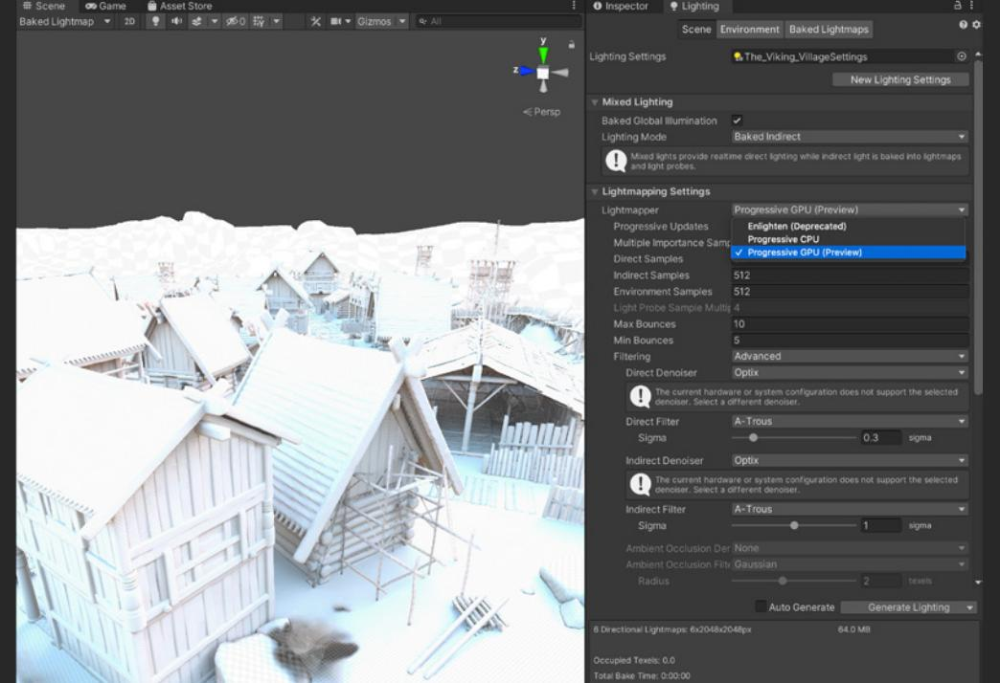

Preview of a baked Lightmap

#### <span id="page-48-0"></span>Light Probes

Global Illumination produces beautiful indirect lighting, but this can be expensive to calculate and store on disk. If you have set dressing or other static meshes that don't absolutely require lightmapping, consider removing them from your lightmap bakes and use [Light Probes](https://docs.unity3d.com/Manual/LightProbes.html?) instead.

In this example, Light Probes could approximate both direct and bounced lighting for the smaller objects, reserving the higher-quality lightmapping where it's more noticeable.

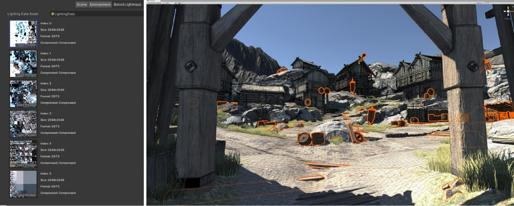

Lightmaps applied to the *Viking Village* project Use Light Probes for smaller details where lightmapping is less noticeable.

Formerly reserved for dynamic objects, Light Probes can apply to static meshes as well. In the MeshRenderer component, locate the **Receive Global Illumination** dropdown and toggle it from **Lightmaps** to **Light Probes**.

| · Inspector                                                                           |                    |     |        | a :        |  |  |
|---------------------------------------------------------------------------------------|--------------------|-----|--------|------------|--|--|
| 8<br>build_tower_01<br>V                                                              |                    |     |        | - Static - |  |  |
| Tag Untagged                                                                          | Layer Default<br>> |     |        |            |  |  |
| 25<br>Transform<br>D                                                                  |                    |     |        | 0 :        |  |  |
| Position                                                                              | × 0                | Y 0 | 2<br>0 |            |  |  |
| Rotation                                                                              | × 0                | Y O | Z<br>0 |            |  |  |
| Scale                                                                                 | × 1                | Y 1 | 2<br>1 |            |  |  |
| 13<br>Build_tower_01 (Mesh Filter)<br>V                                               |                    |     |        | 0 元<br>    |  |  |
| Mesh                                                                                  | build_tower_01     |     |        | 0          |  |  |
| - Mesh Renderer                                                                       |                    |     |        | 0 7        |  |  |
| > Materials                                                                           |                    |     |        | 3          |  |  |
| V Lighting                                                                            |                    |     |        |            |  |  |
| Cast Shadows                                                                          | On                 |     |        |            |  |  |
| Contribute Global Illumination                                                        | Lightmaps          |     |        |            |  |  |
| Receive Global Illumination                                                           | V Light Probes     |     |        |            |  |  |
| V Probes                                                                              |                    |     |        |            |  |  |
| Light Probes                                                                          | Off                |     |        |            |  |  |
| Reflection Probes                                                                     | Simple             |     |        | >          |  |  |
| Anchor Override                                                                       | None (Transform)   |     |        | O          |  |  |
| In Deferred Shading, all objects receive shadows and get per-pixel reflection probes. |                    |     |        |            |  |  |
| Additional Settings                                                                   |                    |     |        |            |  |  |
| Dynamic Occlusion                                                                     | V                  |     |        |            |  |  |
| Rendering Layer Mask                                                                  | Layer1             |     |        |            |  |  |

Selecting Light Probes

Light Probe illumination does not require proper UVs, saving you the extra step of unwrapping your meshes. The Spherical Harmonics basis functions used in probe lighting make it fast to calculate relative to lightmapping.

Arrange Light Probes and Light Probe Groups spatially in the scene. Probe lighting typically bakes faster than lightmapping.


A Light Probe Group with Light Probes spread across the level

See [Static Lighting with Light Probes](https://blog.unity.com/technology/static-lighting-with-light-probes) for information about selectively lighting scene objects with [Light Probes.](https://docs.unity3d.com/Manual/LightProbes.html)

For more about lighting workflows in Unity, read [Making believable visuals in Unity](https://docs.unity3d.com/2020.1/Documentation/Manual/BestPracticeMakingBelievableVisuals.html?).

<span id="page-50-0"></span>

Adaptive probe volumes in a scene

Manually placing light probes can be tedious and imprecise. **Adaptive probe volumes (APVs) in Unity 2022 LTS** (named Probe Volumes in the Editor) offer a more accurate solution by automating light probe positions. This results in higher-quality lighting that works per pixel, not per object. APVs are supported in HDRP with URP support coming soon. Learn more in this [Unite 2022 talk.](https://www.youtube.com/watch?v=DlxuvvYZO4Q)

Unity 2022 LTS and HDRP (versions 14 and up) bring improvements to the workflows for APVs, including:

- Adds a system that reduces leaks based on probe validity. This includes the new Probe Touch up Volume that you can use to tune values in specific areas.
- Allows you to bake separate lighting scenarios and blend between them
- Uses a more efficient data layout to optimize asset loading time

#### <span id="page-51-0"></span>Tips for the Universal Render Pipeline

[URP](https://docs.unity3d.com/Packages/com.unity.render-pipelines.universal@14.0/manual/whats-new/urp-whats-new.html) is designed to be efficient for you to learn, customize, and scale to all Unity-supported platforms. Our top goal is that URP is the leading renderer for mobile, XR, and untethered hardware.

URP is the successor to our Built-in Render Pipeline. It will provide all the functionality you are familiar with, but with better performance, greater customizability, and more productive workflows.

#### **In-depth technical resources for URP**

- *[The Universal Render Pipeline for advanced Unity users](https://unity.com/resources/introduction-universal-render-pipeline-for-advanced-unity-creators?isGated=false)*: This e-book was created by a highly experienced Unity developer in collaboration with senior graphics engineers at Unity. Topics covered include:
	- How to set up URP for a new project or convert an existing Built-in Render Pipeline-based project to URP
	- A comparison of URP and Built-in Render Pipeline Quality settings
	- Lighting in URP, namely lighting a new scene, managing shadows, Light Modes, Light Layers, Light Probes, and more
	- A comparison of URP and Built-in Render Pipeline shaders
	- Callback differences between the two rendering pipelines
	- Shader Graph, Visual Effects Graph, 2D features, and integrating post-processing effects with URP
- *[Recipes for popular visual effects using the Universal Render Pipeline](https://unity.com/resources/the-universal-render-pipeline-cookbook-unity-2022-lts-edition?isGated=false)*: This handy cookbook provides 12 recipes for popular visual effects that can be applied to a wide range of games, art styles, and platforms.

Let's look at some helpful tips for using URP in Unity 2022 LTS.

1. URP provides a [Universal Renderer](https://docs.unity3d.com/Packages/com.unity.render-pipelines.universal@13.1/manual/urp-universal-renderer.html?) that supports Forward, [Forward+](https://docs.unity3d.com/Packages/com.unity.render-pipelines.universal@16.0/manual/rendering/forward-plus-rendering-path.html) and [Deferred](https://docs.unity3d.com/Packages/com.unity.render-pipelines.universal@13.1/manual/rendering/deferred-rendering-path.html?) rendering paths, as well as a [2D Renderer](https://docs.unity3d.com/Packages/com.unity.render-pipelines.universal@13.1/manual/2d-index.html?).

URP provides equal, if not better performance than the Built-in Render Pipeline for comparable Quality settings in the majority of cases. For example, it evaluates real-time lighting more efficiently. In Forward rendering it evaluates all lighting in a single pass. Forward+ rendering, available in 2022 LTS and later, improves upon standard Forward rendering by culling lights spatially rather than per object. This increases the overall number of lights that can be utilized in rendering a frame.

In Deferred rendering, it supports the Native RenderPass API, allowing G-buffer and lighting passes to be combined into a single render pass.

URP is also compatible with the latest artist-friendly tools, such as [Shader](https://docs.unity3d.com/Packages/com.unity.shadergraph@13.0/manual/index.html?)  [Graph,](https://docs.unity3d.com/Packages/com.unity.shadergraph@13.0/manual/index.html?) [VFX Graph](https://docs.unity3d.com/Packages/com.unity.visualeffectgraph@12.1/manual/index.html?), and the [Rendering Debugger.](https://docs.unity3d.com/Packages/com.unity.render-pipelines.universal@14.0/manual/features/rendering-debugger.html)

2. The [Rendering Layers](https://docs.unity3d.com/Packages/com.unity.render-pipelines.universal@14.0/manual/features/rendering-layers.html?) feature lets you configure certain Lights to affect only specific GameObjects. With the [Custom Shadow Layers](https://docs.unity3d.com/Packages/com.unity.render-pipelines.universal@14.0/manual/features/rendering-layers.html#shadow-layers) property, you can configure certain GameObjects to cast shadows only from specific Lights (even if those Lights do not affect the GameObjects).

Rendering Layers work not only with Lights, but also with Decals.

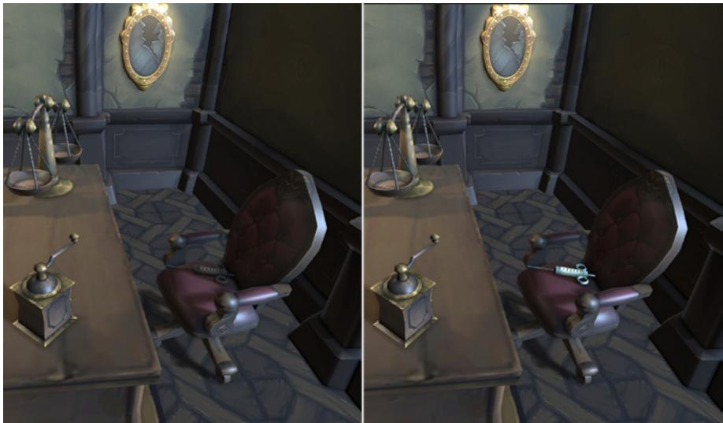

Highlighting an object using Rendering Layers

3. Decal Projectors are a great way of adding detail to a mesh. Use them for elements such as bullet holes, footsteps, signage, cracks, and more. Because they use a projection framework they conform to an uneven or curved surface. To use a Decal Projector with URP, you need to locate your Renderer Data asset and add the **Decal Renderer Feature**.


Adding the Decal Renderer Feature

For most purposes, you can accept the default settings (learn more about these [here](https://docs.unity3d.com/Packages/com.unity.render-pipelines.universal@14.0/manual/renderer-feature-decal.html)).

Now your scene is ready for Decals. Create a Decal by right-clicking in the Hierarchy view and select **Rendering > URP Decal Projector.** By default, the projector uses the material Decal, which will project a white square onto a surface. Use the usual tools to position and orientate the projector. Adjust the **Width**, **Height** and **Projection Depth** in the Inspector. To customize the decal create a material using the **Shader Graph > Decal** shader. This shader has three inputs: Base Map, Normal Map, and Normal Blend. Once the material is prepared, assign it to the Decal Projector.

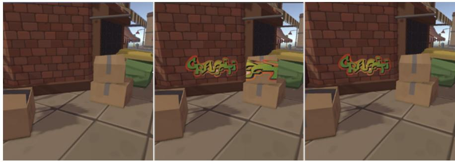

From left to right: No decal in the image, the decal hitting all objects, and the decal applied to the wall only, using Rendering Layers

4. Even if you follow the correct steps to convert a Built-in Render Pipeline project to URP (you can find the steps in the e-book *[Introduction to the](https://unity.com/resources/introduction-universal-render-pipeline-for-advanced-unity-creators?isGated=false)  [Universal Render Pipeline for advanced Unity creators](https://unity.com/resources/introduction-universal-render-pipeline-for-advanced-unity-creators?isGated=false)*), you might find that your scenes are suddenly colored magenta. This is because the shaders used by the materials in a Built-in Render Pipeline project are not supported in URP. Fortunately, there is a method to restore your scenes to their original quality.

Go to **Window > Rendering > Render Pipeline Converter**. Choose **Convert Built-n to 2D (URP)** for a 2D project, or **Built-In to URP** for a 3D project. Assuming that your project is 3D, you'll need to select the [appropriate](https://docs.unity3d.com/Packages/com.unity.render-pipelines.universal@13.1/manual/features/rp-converter.html?)  [converters:](https://docs.unity3d.com/Packages/com.unity.render-pipelines.universal@13.1/manual/features/rp-converter.html?)

- **Rendering Settings:** Select this to create multiple Render Pipeline setting assets that will match Built-in Render Pipeline Quality settings as closely as possible. This lets you test different Quality Levels more efficiently. See the section in the [URP e-book](https://unity.com/resources/introduction-universal-render-pipeline-for-advanced-unity-creators-2022lts?isGated=false) on comparing Built-in Render Pipeline and URP Quality options for more details.
- **Material Upgrade**: Use this to convert materials from the Built-in Render Pipeline to URP.
- **Animation Clip Converter:** This converts animation clips. It runs once the Material Upgrade converter finishes.
- **Read-only Material Converter:** This converts the prebuilt, readonly Materials included in a Unity project. It indexes the project and creates the temporary .index file. Note that it can take significant time. Add in a quick tips list for the SRPs as I suggested in the draft (under the lighting section).

Once you select one or more of the above converters, either click **Initialize Converters** or **Initialize And Convert** (the latter option is included in the Render Pipeline Converter window in Unity 2022 LTS). Whichever option you choose, the project will be scanned, and those assets that need converting will be added to each of the converter panels. If you choose **Initialize Converters**, you can limit the conversions by deselecting the items using the checkbox provided for each one. At this stage, click **Convert Assets** to start the conversion process. If you choose **Initialize And Convert**, the conversion starts automatically after the converters are initialized. Once it's complete, you might be asked to reopen the scene that's active in the Editor.

Unity 2022 LTS provides improvements of the Render Pipeline Converter, including:

- Certain dialogs now show the number of selected elements and the total number of elements.
- You can click each converter to see more information about the elements it converts.
- Material converter section improvements:
	- Items in the list are sorted alphabetically now.
	- The converter handles Materials in packages better.
	- The converter ignores Shader Graph shaders.
- Performance improvement:
	- Indexing is significantly faster, improving the performance of converters that use an .index file.
- 5. If you convert a project from the Built-in Render Pipeline to URP, you might notice differences in the lighting. This is because the Built-in Render Pipeline uses a gamma lighting model by default and URP uses a linear model. As such, any light with an intensity value differing from 1.0 will need to be adjusted.

There are also differences in where to find the Settings controls in-Editor, as well as how to handle the challenge of widely differing hardware specs. The rest of this section covers some tricks you can use to achieve balance between graphic fidelity and performance.

You'll set properties in the three places listed here. The first and second locations are essentially the same for both render pipelines, while the third location applies to URP only:

— **Window > Rendering > Lighting:** This panel allows you to set lightmapping and environment settings, as well as view real-time and baked lightmaps. It is unchanged from the Built-in Render Pipeline to URP.

- **Light Inspector:** There are significant differences between the Built-in Render Pipeline and URP Inspectors. See the [Light Inspector section](https://unity.com/resources/introduction-universal-render-pipeline-for-advanced-unity-creators-2022lts?isGated=false) in the URP e-book for details.
- **URP Asset Inspector:** This is the principal place where you will set shadows. Lighting in URP relies heavily on the settings chosen in this panel.

Quality settings are handled via **Edit > Project Settings > Quality** in the Built-in Render Pipeline. In URP, this depends on the URP Asset settings which can be swapped using the **Quality** panel (See the [Quality settings](https://unity.com/resources/introduction-universal-render-pipeline-for-advanced-unity-creators-2022lts?isGated=false)  [section](https://unity.com/resources/introduction-universal-render-pipeline-for-advanced-unity-creators-2022lts?isGated=false) in the URP e-book).

6. Shadow settings are no longer available via **Project Settings > Quality**. You need a Renderer Data object and a Render Pipeline Asset when using URP. There is a section on setting up a project for URP in the URP [e-book](https://unity.com/resources/introduction-universal-render-pipeline-for-advanced-unity-creators-2022lts?isGated=false) that covers how to view your scene via the Render Pipeline Asset, which you can use to define the fidelity of your shadows.

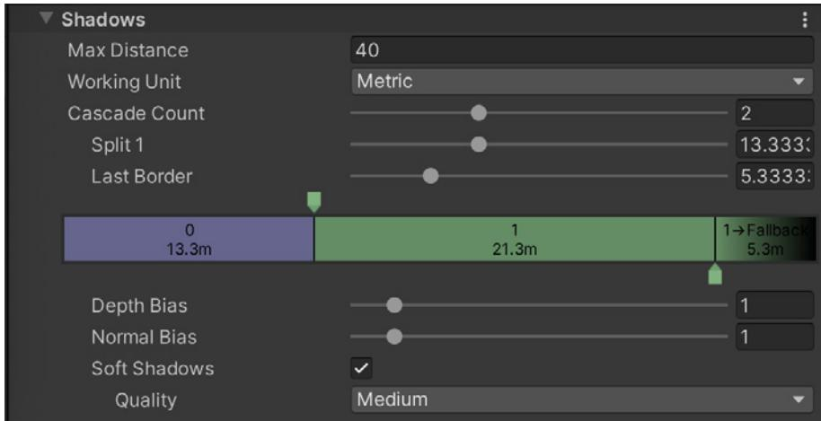

The URP Asset

The Lighting and Shadow groups in the URP Asset are key to setting up shadows in your scene. First, set the **Main Light Shadow** to **Disabled** or **Per Pixel**, then go to the checkbox to enable **Cast Shadows**. The last setting is the resolution of the shadow map.

Another important setting for the Main Light Shadow is Max Distance. This is set in scene units. The Max Distance property needs to relate directly to what the user can see, as well as the units used in the scene. Aim for the minimum distance that gives acceptable shadows (see note below). If the player only sees shadows from dynamic objects 60 units from the Camera, then set Max Distance to 60.

- 7. A great feature of SRPs is that you can add code at just about any stage of the rendering process using a C# script. Scripts can be injected at stages such as:
	- Rendering shadows
	- Rendering prepasses
	- Rendering G-buffer
	- Rendering Deferred lights
	- Rendering opaques
	- Rendering Skybox
	- Rendering transparents
	- Rendering post-processing

You can inject scripts in the rendering process via the **Add Renderer Feature** option in the Inspector for the **Universal Renderer Data Asset**. Remember, when using URP, there is a Universal Renderer Data object and a URP Asset. The URP Asset has a Renderer List with at least one Universal Renderer Data object assigned. It is the asset you assign in **Project Settings > Graphics > Scriptable Render Pipeline Settings**.

If you are experimenting with multiple setting assets for different scenes, then attaching the following script to your Main Camera can be useful. Set the **Pipeline Asset** in the Inspector. Then it will switch the asset when the new scene is loaded.

```
using UnityEngine;
using UnityEngine.Rendering;
using UnityEngine.Rendering.Universal;
 [ExecuteAlways]
public class AutoLoadPipelineAsset : MonoBehaviour
{
   public UniversalRenderPipelineAsset pipelineAsset;
   void OnEnable()
   {
 if (pipelineAsset)
 {
 GraphicsSettings.renderPipelineAsset = 
 pipelineAsset;
 } 
   }
}
```
Script to switch Universal Render Pipeline Asset on scene load

#### <span id="page-57-0"></span>Tips for the High Definition Render Pipeline

With HDRP's cutting-edge real-time 3D graphics, you can take players to visually stunning environments that push the boundaries of game design. HDRP extends Unity's existing lighting system with a variety of features to make rendering your scene more closely resemble real-world lighting, including:

- Physical light units and advanced lighting
- Skyscapes
- Terrains
- Water system
- Fog
- Volume system
- Post-processing
- Advanced shadows
- Advanced reflections
- Extensibility

Unity 2022 LTS and above includes the HDRP package with the installation to ensure that you're always running on the latest verified graphics code. When you install the most recent Unity release, it also installs the corresponding version of HDRP. Tying the HDRP graphics packages to a specific Unity release helps ensure compatibility. However, you can also switch to a custom version of HDRP by overriding the manifest file.

The e-book *[Definitive guide to lighting in the High Definition Render Pipeline](https://unity.com/resources/hdrp-lighting-environments-2022-lts-ebook?isGated=false)  [in Unity](https://unity.com/resources/hdrp-lighting-environments-2022-lts-ebook?isGated=false)* provides hundreds of pages detailing what HDRP systems do, how to understand their capabilities so you can use them in the best way possible for your project, and step-by-step instructions for implementing and tweaking them.

1. The **HDRP Global Settings** section (or **HDRP Default Settings** prior to version 12) determines the baseline configuration of the project. You can override these settings in the scene by placing local or global Volume components, depending on the camera position (see Volumes below).

Global Settings save in their own separate Pipeline Asset defined at the top field. Set up the default rendering and post-processing options here.

As you develop your project, you might need to return to the **Global** settings to toggle a specific feature on or off. Some features will not render unless the corresponding checkbox in **HDRP Global Settings** is enabled. Make sure you only enable features you require because they might negatively impact the rendering performance and memory usage. Also, certain settings will appear in the **Volume Profiles**, while other features appear in the **Frame Settings**, depending on usage.

While familiarizing yourself with HDRP's feature set, make use of the top right Search field in the Project Settings. This will only show you the relevant panels with the search terms highlighted.

|                  | Project Settings                            |           |              |   |
|------------------|---------------------------------------------|-----------|--------------|---|
| Project Settings |                                             |           |              |   |
|                  |                                             |           | a refraction | × |
|                  | HDRP Global Settings   HDRP Global Settings |           |              | @ |
|                  | Low Resolution Transparent                  |           |              |   |
|                  | Ray Tracing                                 | < < < < < |              |   |
|                  | Custom Pass                                 |           |              |   |
|                  | Motion Vectors                              |           |              |   |
|                  | Opaque Object Motion                        | <         |              |   |
|                  | Transparent Object Motion                   | V         |              |   |
|                  | Refraction                                  | < < <     |              |   |
|                  | Distortion                                  |           |              |   |
|                  | Rough Distortion                            |           |              |   |
|                  | Post-process                                |           |              |   |
|                  | Custom Post-process                         |           |              |   |
|                  | Stop NaN                                    | < < <     |              |   |
|                  | Depth Of Field                              |           |              |   |

Search for HDRP features

Enabling a feature in the HDRP Global Settings does not guarantee it can be rendered at any time by any camera. You must ensure that the Render Pipeline Asset whose Quality level is selected under **Projects Settings > Quality** supports that feature as well. For instance, to ensure cameras can render Volumetric Clouds, you must toggle them under **HDRP Global Settings > Frame Settings > Camera > Lighting** and in the active Render Pipeline Asset, under **Lighting > Volumetrics**.

2. HDRP uses a **Volume framework**. This system allows you to split up your Scene and enable certain settings or features based on camera position. A volume is just a placeholder object with a Volume component. You can create one through the **GameObject > Volume** menu by selecting a preset. Otherwise, simply make a GameObject with the correct components manually.

| Volume<br>A<br>Cinemachine                                                | Global Volume<br>Sky and Fog Global Volume        |
|---------------------------------------------------------------------------|---------------------------------------------------|
| Camera<br>Rendering<br>Visual Effects<br>Visual Scripting Scene Variables | Box Volume<br>Sphere Volume<br>Convex Mesh Volume |
| Center On Children                                                        | Custom Pass                                       |

Creating a Volume object using presets

A Volume component itself contains no actual data. Instead, it references a **Volume Profile**, a ScriptableObject Asset on disk that contains HDRP settings to render the scene.

The Light Explorer (**Window > Rendering > Light Explorer > Volumes**) can help you locate the volumes in the loaded scenes. Use this interface to make quick adjustments.

| Isolate Selection Show Inactive Objects |                        |        |  |          | 0                           |                                 |  |           |  |     |            |
|-----------------------------------------|------------------------|--------|--|----------|-----------------------------|---------------------------------|--|-----------|--|-----|------------|
| Enabled Name                            |                        | Mode   |  | Priority | Volume Profile              | Has Visual Environment Sky Type |  |           |  | Fog | Volumetric |
| >                                       | Volume Room 2 Skylight | Local  |  |          | VolumeRoom2Skylight (Volı ⊙ |                                 |  | None      |  |     |            |
| V                                       | Volume Global          | Global |  | O        | VolumeGlobal (Volume Prof O | V                               |  | HDRI SK ▼ |  | V   | V          |
| V                                       | Volume Room 3 Sitting  | Local  |  |          | VolumeRoom3Sitting (Volur O |                                 |  | None      |  |     |            |
| V                                       | Volume Room 3 Corridor | Local  |  |          | VolumeRoom3Corridor (Volt O |                                 |  | None      |  | V   |            |
| >                                       | Volume Room 1          | Local  |  |          | VolumeRoom1 (Volume Prof O  |                                 |  | None      |  |     |            |
| V                                       | Volume Room 2          | Local  |  |          | VolumeRoom2 (Volume Pro1 ⊙  |                                 |  | None      |  |     |            |
| >                                       | Volume Room 3          | Local  |  |          | VolumeRoom3 (Volume Prof ⊙  |                                 |  | None      |  | V   |            |
|                                         |                        |        |  |          |                             |                                 |  |           |  |     |            |
|                                         |                        |        |  |          |                             |                                 |  |           |  |     |            |

The Light Explorer can list all the Volumes in the open Scene(s).

3. Each Volume Profile begins with a set of default properties. To edit their values, use Volume Overrides and customize the individual settings. For example, Volumes Overrides could modify the Volume's Fog, Postprocessing, or Exposure.

Adding overrides is a key workflow in HDRP. If you understand the concept of inheritance from programming, Volume Overrides will seem familiar to you.

The higher-level Volume settings serve as the defaults for lower-level Volumes. Here, the HDRP Default Settings pass down to the global Volume. This, in turn, serves as the "base" for the local Volumes.

| V V Volume                |                               |   | @ 花            |   |
|---------------------------|-------------------------------|---|----------------|---|
| Mode                      | Global                        |   |                |   |
| Weight                    |                               |   | ● 1            |   |
| Priority                  | 0                             |   |                |   |
| Profile                   | VolumeGlobal (Volume Profile) |   | · New<br>Clone |   |
| 4<br>✓ Visual Environment |                               |   | @              | 3 |
| A<br>> HDRI Sky           |                               |   | 0              |   |
| 4<br>√ Tonemapping        |                               |   | @              |   |
| A<br>> Exposure           |                               |   | @              |   |
| J Fog<br>D                |                               |   | @              |   |
| A<br>✓ Shadows            |                               |   | @              | : |
| ✓ Contact Shadows<br>A    |                               |   | 0              |   |
| V Ambient Occlusion<br>A  |                               |   | @              |   |
| A<br>V Bloom              |                               |   | @              |   |
| A<br>V Motion Blur<br>4   |                               |   | @              |   |
| ✓ Film Grain<br>A         |                               |   | @<br>9         |   |
| V Screen Space Refraction |                               |   |                |   |
|                           | Add Override                  |   |                |   |
| ಡ                         |                               |   |                |   |
|                           | Volume Overrides              |   |                |   |
|                           | Lighting                      | > |                |   |
|                           | Material                      | > |                |   |
|                           | Post-processing               | > |                |   |
|                           | Ray Tracing                   | > |                |   |
|                           | Shadowing                     | > |                |   |
| Sky                       |                               | > |                |   |
|                           |                               |   |                |   |

Add HDRP features using Volume Overrides.

The Global Volume overrides the HDRP Default Settings. The Local Volumes, in turn, override the Global Volume. Use the **Priority**, **Weight**, and **Blend Distance** (outlined below) to resolve any conflicts from overlapping Volumes. To debug the current values of a given Volume component, you can use the Volume tab in the Rendering Debugger.

| Sequences<br>. Lighting | Debug                         |                    |                                                               | <br>Reset     |
|-------------------------|-------------------------------|--------------------|---------------------------------------------------------------|---------------|
|                         | Volume                        |                    |                                                               |               |
| HDRPGraph               | Component<br>Camera           |                    | Fog<br>MainCamera                                             | V<br>4        |
| Decals                  |                               |                    |                                                               |               |
| Material                | Parameter<br>Volume Info      | Interpolated Value | /_And_Fog (Mich-L_Sky_and_Fog_Settings_Profi<br>Global (100%) | Default Value |
| Lighting                | Albedo<br>Anisotropy          | 0                  | 0                                                             | 0             |
| Volume                  | Base Height                   | 2                  | 2                                                             | 0             |
|                         | Color                         |                    |                                                               |               |
| Rendering               | Color Mode                    | ConstantColor      | ConstantColor                                                 | SkyColor      |
|                         | Denoising Mode                | Gaussian           | Gaussian                                                      | Gaussian      |
| Scene Camera            | Depth Extent                  | 30                 | 30                                                            | 64            |
| MainCamera              | Directional Lights Only       |                    |                                                               |               |
|                         | Enabled                       | >                  | >                                                             |               |
| Camera_to_GameScre      | Volumetric Fog                | >                  | >                                                             |               |
|                         | Filter                        |                    |                                                               |               |
|                         | Ambient Light Probe Dimmer    | 0                  | 0                                                             | 1             |
|                         | Fog Control Mode              | Balance            | Balance                                                       | Balance       |
|                         | Resolution Depth Ratio        | 0.666              | 0.666                                                         | 0.5           |
|                         | Volumetric Fog Budget         | 0.33               | 0.33                                                          | 0.25          |
|                         | Max Fog Distance              | 10                 | 10                                                            | 5000          |
|                         | Maximum Height                | 7.92               | 7.92                                                          | 50            |
|                         | Fog Attenuation Distance      | 100                | 100                                                           | 400           |
|                         | Mip Fog Far                   | 1000               |                                                               | 1000          |
|                         | Mip Fog Max Mip               | 0.5                |                                                               | 0.5           |
|                         | Mip Fog Near                  | 0                  |                                                               | 0             |
|                         | Quality                       | 1                  | 1                                                             | 1             |
|                         | Screen Resolution Percentage  | 12.5               |                                                               | 12.5          |
|                         | Slice Distribution Uniformity | 1                  | 1                                                             | 0.75          |
|                         | Tint                          |                    |                                                               | HDR           |
|                         | Volume Slice Count            | 64                 |                                                               | 64            |

Debugging a Volume

You can find a complete Volume Overrides List in the HDRP documentation.

4. Baked global illumination (GI) pre-computes light interactions within a scene and stores the results as textures called lightmaps. When developing for mobile platforms, this is often a common strategy for adding realistic lighting to the game environment. When baking lighting, the intensive computations are performed offline, just once.

Optimizing Baked GI is a strategic balance of visual quality with computational efficiency and memory management.

Here's a general list of tips for lightmapping:

- **Lightmap Resolution:** Higher resolutions capture more detail but increase memory usage. Prioritize larger resolutions for hero objects, and reduce the resolutions for elements in the background.
- **Don't waste texels.** Small or thin objects, like pebbles or wires, can disproportionately use lightmap resources. Disable **Contribute Global Illumination** in either the Static menu or MeshRenderer to exclude those objects from GI calculations unless they significantly influence scene lighting (e.g., are brightly colored or have emissive materials).


Don't waste texels on small or thin objects.

- **Sampling:** The number of samples directly influences the light bake's quality. More samples yield richer lighting details but extend bake times.
- **Denoising:** In certain conditions like low lighting, baking can introduce visual noise. Choose **Auto** to allow HDRP to choose a denoising algorithm automatically. Otherwise, select **Advanced** to select the Direct Denoiser and Indirect Denoiser.
- **Lightmap Compression:** Compression techniques can decrease memory usage but with a potential minor loss in quality.
- **Anti-aliasing:** To optimize performance, consider reducing the antialiasing level. For instance, switch from 8x Multi Sampling to 2x Multi Sampling in **Project Settings > Quality**.
- 5. You can choose between two backends for the Progressive Lightmapper, run on the CPU or the GPU. The Progressive GPU Lightmapper accelerates the generation of baked lightmaps with your computer's GPU and Dedicated Video Ram (VRAM).

When using the GPU Lightmapper, consider these suggestions to optimize bake speed:

- Close other GPU-accelerated applications, especially those that use VRAM
- Switch to a CPU-based denoiser, like Intel Open Image, to free up VRAM
- If you have multiple GPUs, allocate one for rendering and another for baking
- Reduce the number of Anti-aliasing samples, especially for lightmap sizes of 4096 or above

See [this documentation page](https://docs.unity3d.com/Manual/progressive-lightmapper.html) for more information.

### <span id="page-62-0"></span>Developer workflows

There are always small but helpful shortcuts and tips that even long-time Unity developers can benefit from. Whether it's a small Property Attribute attached to a script variable or a handy but often-overlooked Editor setting, we're sure that you'll find plenty here to speed up your workflows.

Developer quality-of-life improvements are key to being more efficient and productive in your day-to-day activities. More of Unity is now taking advantage of Burst, giving you shorter iteration times, improved debugging insights, and a more responsive Inspector.

Async and await constructs now give you more efficient asynchronous programming, and you'll find it faster to get in and out of Play mode, resulting in more coding and less waiting.

#### Attributes

Unity has a variety of Attributes that can be placed above a class, property, or function to indicate special behavior such as creating headers, spacing or ranged fields in the inspector.

| Attribute        | Description                                                                                                                                                                                                      | Example                                                                                                                                                                                                                                                  |  |  |  |  |
|------------------|------------------------------------------------------------------------------------------------------------------------------------------------------------------------------------------------------------------|----------------------------------------------------------------------------------------------------------------------------------------------------------------------------------------------------------------------------------------------------------|--|--|--|--|
| SerializeField   | This forces Unity to serialize a private<br>field and makes it visible in the<br>Inspector.                                                                                                                      | [SerializeField]<br>private GameObject myObject;                                                                                                                                                                                                         |  |  |  |  |
| Range            | This attribute takes a float or int variable<br>restricted to a specific range. The field<br>appears as a slider in the Inspector.                                                                               | [Range(1,6)]<br>public int integerRange;<br>[Range(0.2f, 0.8f)]<br>public float floatRange;                                                                                                                                                              |  |  |  |  |
| HideInInspector  | This makes a variable not appear in the<br>Inspector but be serialized.                                                                                                                                          | [HideInInspector]<br>public int p = 5;                                                                                                                                                                                                                   |  |  |  |  |
| RequireComponent | This automatically adds required<br>components as dependencies to avoid<br>setup errors.<br>Note: This attribute only checks the<br>moment that the Component is added to<br>a GameObject.                       | // PlayerScript requires the GameObject<br>o have a Rigidbody<br>[RequireComponent(typeof(Rigidbody))]<br>public class PlayerScript: Monobehaviour<br>{<br>private Rigidbody rBody;<br>void Start()<br>{<br>rBody = GetComponent<Rigidbody>();<br>}<br>} |  |  |  |  |
| Tooltip          | This shows a tooltip when the user<br>hovers a mouse over a field in the<br>Inspector.                                                                                                                           | public class PlayerScript: Monobehaviour<br>{<br>[Tooltip("Health value between 0 and<br>100.")]<br>int health = 0;<br>}                                                                                                                                 |  |  |  |  |
| Space            | This adds a small space between your<br>fields (without any additional text) to<br>create visual separation between your<br>fields.                                                                              | [Space(10)] // 10 pixel of spacing added<br>int p = 5;                                                                                                                                                                                                   |  |  |  |  |
| Header           | This adds some bold text and spacing<br>to help organize your variables in the<br>Inspector. Only add this to the first field<br>that you want to belong to the group.                                           | public class PlayerScript: Monobehaviour<br>{<br>[Header("Health Settings")]<br>public int health = 0;<br>public int maxHealth = 100;<br>[Header("Shield Settings")]<br>public int shield = 0;<br>public int maxShield = 0;<br>}                         |  |  |  |  |
| Multiline        | This makes the string editable with the<br>multiline text field. Pass in an optional int<br>to designate the number of lines.<br>Tip: Use this for annotating scripts with<br>notes to yourself or another user. | [Multiline]<br>public string textToEdit;<br>[Multiline(20)]<br>public string moreTextToEdit;                                                                                                                                                             |  |  |  |  |

<span id="page-64-0"></span>

| SelectionBase | This is useful for selecting an otherwise<br>empty GameObject whose children<br>may contain meshes. Add the attribute<br>to any component on the base object.<br>When picking objects in the Editor,<br>the GameObject containing the<br>[SelectionBase] attribute gets selected<br>rather than the children. | // add this to the base GameObject<br>[SelectionBase]<br>public class PlayerScript: Monobehaviour<br>{<br>} |
|---------------|---------------------------------------------------------------------------------------------------------------------------------------------------------------------------------------------------------------------------------------------------------------------------------------------------------------|-------------------------------------------------------------------------------------------------------------|
|---------------|---------------------------------------------------------------------------------------------------------------------------------------------------------------------------------------------------------------------------------------------------------------------------------------------------------------|-------------------------------------------------------------------------------------------------------------|

This is just a small sample of the numerous Attributes. Do you want to [rename](https://docs.unity3d.com/ScriptReference/Serialization.FormerlySerializedAsAttribute.html?)  [your variables without losing their values](https://docs.unity3d.com/ScriptReference/Serialization.FormerlySerializedAsAttribute.html?)? O[r invoke some logic without needing](https://docs.unity3d.com/ScriptReference/RuntimeInitializeOnLoadMethodAttribute.html?)  [an empty GameObject?](https://docs.unity3d.com/ScriptReference/RuntimeInitializeOnLoadMethodAttribute.html?) See the Scripting API for a complete list of [Attributes](https://docs.unity3d.com/ScriptReference/AddComponentMenu.html?) for everything that's possible.

You can even create your own [PropertyAttribute](https://docs.unity3d.com/ScriptReference/PropertyAttribute.html) to define custom Attributes for your script variables.

#### Custom windows and Inspectors

One of Unity's most powerful features is its extensible Editor. We recommend that you use the [UI Toolkit](https://docs.unity3d.com/Packages/com.unity.ui.builder@1.0/manual/index.html) package to create Editor UIs such as custom windows and Inspectors (you can also use the immediate [mode IMGUI](https://docs.unity3d.com/2022.3/Documentation/ScriptReference/UnityEngine.IMGUIModule.html?))

UI Toolkit has a workflow similar to standard web development. Use its HTML and XML inspired markup language, **UXML**, to define user interfaces and reusable UI templates. Then, apply **Unity Style Sheets (USS)** to modify the visual style and behaviors of your UIs.

Alternatively, you can use immediate mode IMGUI. Derive from the **[Editor](https://docs.unity3d.com/ScriptReference/Editor.html?)** base class, then use the **CustomEditor** attribute.

|        | O Inspector |                      |                    |               |    | a :      |   |
|--------|-------------|----------------------|--------------------|---------------|----|----------|---|
| A      | V           | GameObject           |                    |               |    | Static ▼ |   |
|        |             |                      | >                  |               |    |          | > |
|        |             | Tag Untagged         |                    | Layer Default |    |          |   |
| 2<br>A |             | Transform            |                    |               | @  | 2        |   |
| #<br>2 |             | V My Player (Script) |                    |               | @  | 2        |   |
|        |             |                      |                    |               |    |          |   |
|        | Damage      |                      |                    |               | 35 |          |   |
|        |             |                      | Damage             |               |    |          |   |
|        | Armor       |                      |                    |               | 75 |          |   |
|        |             |                      | Armor              |               |    |          |   |
|        |             |                      |                    |               |    |          |   |
|        | Gun Object  |                      | None (Game Object) |               |    |          | 0 |
|        |             |                      |                    |               |    |          |   |
|        |             |                      | Add Component      |               |    |          |   |
|        |             |                      |                    |               |    |          |   |
|        |             |                      |                    |               |    |          |   |

Either solution can make a **[custom Inspector](https://docs.unity3d.com/ScriptReference/Editor.html?)**.

A custom Editor modifies how the MyPlayer script displays in the Inspector.

See **[Creating user interfaces \(UI\)](https://docs.unity3d.com/Manual/UIToolkits.html?)** for more detail on how to implement custom Editor scripts using either UI Toolkit or IMGUI. For a quick introduction to **UI Toolkit**, watch the **[Getting Started with Editor Scripting](https://www.youtube.com/watch?v=mTjYA3gC1hA)** tutorial.

#### <span id="page-65-0"></span>Custom menus

Unity includes a simple way to customize Editor menus and menu items, the **MenuItem** Attribute. You can apply this to any static method in your scripts.

If you have functions for your project that you will use frequently, organize them into menu items. This allows you to build a basic user interface with just a single PropertyAttribute modifier.


The MenuItem Attribute creates a simple interface to attach the static method (Take Screenshot).

#### Enter Play Mode settings

When you enter Play Mode, your project starts and runs as it would in a build. Any changes you make in the Editor during Play Mode reset when you exit Play Mode.

Each time that you enter Play Mode in the Editor, Unity performs two significant actions:

- **Domain Reload:** Unity backs up, unloads, and recreates scripting states.
- **Scene Reload:** Unity destroys the Scene and loads it again.

These two actions take more and more time as your scripts and Scenes become more complex.

If you don't plan on making any more script changes, the **Enter Play Mode Settings (Edit > Project Settings > Editor)** can save you a bit of compile time. Unity gives you the option to disable either Domain Reload, Scene Reload, or both. This can speed up entering and exiting Play Mode.

<span id="page-66-0"></span>Just remember that if you *do* plan on making further script changes, you need to re-enable Domain Reload. Likewise, if you modify the Scene Hierarchy, you should re-enable Scene Reload. Otherwise, unexpected behavior could result.


The effects of disabling the Reload Domain and Reload Scene settings.

#### Enter Play Mode optimizations

In Unity 2022 LTS, the Enter Play Mode performance is optimized to speed up iteration times. This improvement includes faster scene saving, increased use of multi-threading to speed up static batching and particle prewarming, and a reduced cost on some package initialization times (e.g., TerrainTools and Visual Studio packages).

#### Script templates

Do you find that you make the same changes every time you create a new script? Do you instinctively add a namespace or delete the update event function? Save yourself a few keystrokes and create consistency across the team by setting up the script template for your preferred starting point.

Every time you create a new script or shader, Unity uses a template stored in **%EDITOR\_PATH%\Data\Resources\ScriptTemplates**:

- Windows: *C:\Program Files\Unity\Editor\Data\Resources\ScriptTemplates*
- Mac: */Applications/Hub/Editor/[version]/Unity/Unity.app/Contents/ Resources/ScriptTemplates*

The default Monobehaviour template is this one: **81-C# Script-NewBehaviourScript.cs.txt**

There are also templates for shaders, other behavior scripts, and assembly definitions.

For project-specific script templates, create an **Assets/ScriptTemplates** folder. Copy the script templates into this folder to override the defaults.

You can also modify the default script templates directly for all projects, but make sure that you backup the originals before making any changes.

The original **81-C# Script-NewBehaviourScript.cs.txt** file looks like this:

```
using System.Collections;
using System.Collections.Generic;
using UnityEngine;
#ROOTNAMESPACEBEGIN#
public class #SCRIPTNAME# : MonoBehaviour
{
 // Start is called before the first frame update
 void Start()
 {
 #NOTRIM#
 }
 // Update is called once per frame
 void Update()
 {
 #NOTRIM#
 }
}
#ROOTNAMESPACEEND#
```
There are two keywords that may be helpful to you:

- **#SCRIPTNAME#** indicates the filename entered or the default filename (for example, NewBehaviourScript).
- **#NOTRIM#** ensures that the brackets contain a line of whitespace.

For example, you may want to set up the default Monobehaviour to have default regions in order to stay organized:

```
/*
 * Modified template by Unity Support.
 */
using UnityEngine;
public class #SCRIPTNAME# : MonoBehaviour
{
 #region Public Fields
 #endregion
 #region Unity Methods
 void Start()
 {
 }
 void Update()
 {
 }
 #endregion
 #region Private Methods
 #endregion
}
```
<span id="page-68-0"></span>Relaunch the Unity Editor, and your changes should appear every time you create a custom Monobehaviour.

Modify the other templates in a similar fashion. Remember to keep a copy of your original and modifications somewhere outside the Unity project for safekeeping.

#### Addressables

The [Addressable Asset System](https://docs.unity3d.com/Packages/com.unity.addressables@1.21/manual/index.html) simplifies how you manage the assets that make up your game. Any asset, including Scenes, Prefabs, text assets, and so on, can be marked as "addressable" and given a unique name. You can call this alias from anywhere.

Adding this extra level of abstraction between the game and its assets can streamline certain tasks, such as creating a separate downloadable content pack. This system makes referencing those asset packs easier as well, whether they're local or remote.


In this example, Addressables tracks the inventory of Prefabs.

To begin, install the Addressables package from the Package Manager, and add some basic settings to the project. Each asset or Prefab in the project should have the option to be made "addressable" as a result. Checking the option under an asset's name in the Inspector assigns it a default unique address.


Addressable option enabled with default Addressable Name

Once marked, the corresponding assets appear in the **Window > Asset Management > Addressables > Groups** window.

| # Scene       | Co Profiler                         | Memory Profiler                         | Addressables Groups |      |                                         |  |
|---------------|-------------------------------------|-----------------------------------------|---------------------|------|-----------------------------------------|--|
|               | Create · Profile: Default · Tools · |                                         |                     |      | Play Mode Script ▼ Build ▼ Q.           |  |
|               | Group Name \ Addressable Name       |                                         |                     | Path |                                         |  |
| Built In Data |                                     |                                         |                     |      |                                         |  |
|               | Inventory Items (Default)           |                                         |                     |      |                                         |  |
|               |                                     | Assets/Weapons/Prefabs/BossSword.prefab | 6                   |      | Assets/Weapons/Prefabs/BossSword.prefab |  |
|               |                                     | Assets/Weapons/Prefabs/Shield.prefab    | 8                   |      | Assets/Weapons/Prefabs/Shield.prefab    |  |
|               |                                     | Assets/Weapons/Prefabs/Sword.prefab     | 7                   |      | Assets/Weapons/Prefabs/Sword.prefab     |  |
|               |                                     |                                         |                     |      |                                         |  |

In Addressables Groups, you can see each asset's custom address, paired with its location.

For convenience, you can either rename each address in the asset's individual Address field or simplify them at once.

Simplify the Addressable Names with a single menu action, or rename them individually.

| C                                  |    | Addressables Groups                                                                                                   |                                        |                      |
|------------------------------------|----|-----------------------------------------------------------------------------------------------------------------------|----------------------------------------|----------------------|
| Addressables Groups                |    |                                                                                                                       |                                        |                      |
| Create ▼ Profile: Default ▼ Tools▼ |    | Play Mode Script ▼ Build ▼ 9.                                                                                         |                                        |                      |
| Group Name \ Addressable & Path    |    |                                                                                                                       | New Build                              | Default Build Script |
| Built In Data                      |    |                                                                                                                       | Update a Previous Build<br>Clean Build |                      |
| V Inventory Items (Default)        |    |                                                                                                                       |                                        |                      |
| BossSword<br>ALL-1-1               | 17 | Assets/Weapons/Prefabs/BossSword.prefab<br>Comments of Children College of Control Concession of Concession Comers of |                                        |                      |

Use the default build script to generate an Addressable Group asset bundle.

Bundle these assets to be hosted on a server elsewhere or distribute them locally with your project. Wherever each asset resides, the system will locate it using the Addressable Name string.

You can now use your addressable assets using the Addressables API.

For example, without Addressables, if you wanted to instantiate a Prefab in your scene, you might do this:

```
public GameObject prefabToCreate;
public void CreatePrefab() 
{
 GameObject.Instantiate(prefabToCreate);
}
```
The disadvantage here is that any referenced Prefab (like prefabToCreate) would load into memory, even if the scene didn't require it.

Using Addressables, you could instead do this:

```
public string prefabByAddress;
… 
public void CreatePrefabWithAddress() 
{
 Addressables.Instantiate(prefabByAddress, instantiationPa-
rameters, bool);
}
```
This loads the asset by its address string. The Prefab does not load into memory until it's needed (when we invoke Adressables.Instantiate inside CreatedPrefabWithAddress). In addition, [Addressables](https://blogs.unity3d.com/2019/07/15/addressable-asset-system/?utm_source=demand-gen&utm_medium=pdf&utm_campaign=asset-links-gmg-choose-unity-for-multiplatform&utm_content=improving-workflows-unity-2020-lts-ebook) provides high-level reference counting and automatically unloads bundles and their associated assets when they're no longer in use.

**[Tales from the Optimization Trenches: Saving Memory with Addressables](https://blog.unity.com/technology/tales-from-the-optimization-trenches-saving-memory-with-addressables)**  offers an example of how to organize your Addressable Groups to be more memory efficient. You can also check out the **[Addressables: Introduction to](https://learn.unity.com/tutorials#5fade876edbc2a00225e815a?)  [Concepts](https://learn.unity.com/tutorials#5fade876edbc2a00225e815a?)** tutorial for a quick overview of how the Addressable Asset system can work in your project.

#### **Operating live games: Cloud Content Delivery with Addressables**

If you are operating a live game, then you might want to consider using Unity's Cloud Content Delivery (CCD) solution with Addressables. The Addressables system stores and catalogs game assets so that they can be automatically found and called, and then CCD pushes those assets directly to your players, completely separate from your code. This reduces your build size and eliminates the need to have your players download and install new game versions whenever you want to make an update. To learn more, read this [blog post](https://blog.unity.com/engine-platform/your-questions-cloud-content-delivery-and-addressables) on the integration between Addressables and Cloud Content Delivery.

#### <span id="page-71-0"></span>Preprocessor directives

The [Platform Dependent Compilation](https://docs.unity3d.com/Manual/PlatformDependentCompilation.html?) feature allows you to partition your scripts to compile and execute code for a specifically targeted platform.

This example makes use of the existing platform **#define** directives with the **#if**  compiler directive:

```
using UnityEngine;
using System.Collections;
public class PlatformDefines : MonoBehaviour 
{
 void Start () 
 {
 #if UNITY_EDITOR
 Debug.Log("Unity Editor");
 #endif
 #if UNITY_IOS
 Debug.Log("Iphone");
 #endif
 #if UNITY_STANDALONE_OSX
 Debug.Log("Stand Alone OSX");
 #endif
 #if UNITY_STANDALONE_WIN
 Debug.Log("Stand Alone Windows");
 #endif
 } 
}
```
Use the **DEVELOPMENT\_BUILD** #define to identify whether your script is running in a player which was built with the **Development Build** option.

You can also compile selectively for specific Unity versions and/or scripting backends.

You can supply your own custom #define directives when testing in the Editor. Open the **Other Settings** panel of the [Player](https://docs.unity3d.com/Manual/class-PlayerSettings.html?) settings, and navigate to **Scripting Define Symbols**.

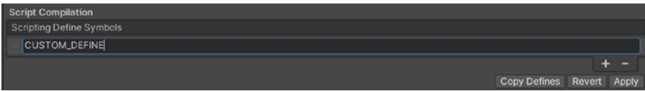

See [Platform Dependent Compilation](https://docs.unity3d.com/Manual/PlatformDependentCompilation.html?) for more information about Unity's preprocessor directives.

#### <span id="page-72-0"></span>ScriptableObjects

A ScriptableObject is a data container that saves large amounts of data, independent of class instances. ScriptableObjects can reduce your project's memory usage by avoiding copies of values.

ScriptableObjects can help promote clean coding practices by separating data from logic. This means it's easier to make changes without causing unintended side effects, which improves testability and modularity. They're also useful when you're collaborating with non-programmers like artists and designers.

Let's use the example of a project that has a p[refab](https://docs.unity3d.com/Manual/Prefabs.html?) that stores unchanging data in an attached MonoBehaviour script. Unlike with MonoBehaviours, the data saved to ScriptableObjects is written to disk as an asset and not attached to a GameObject. Thus, it can persist between sessions.

*Dragon Crashers* demonstrates a typical use case. A UnitInfoData class inherits from **ScriptableObject**. Each of its instances contains the unit's name, sprite, and health settings. This data remains constant over the course of gameplay, making it especially suitable for storage inside a ScriptableObject.


A ScriptableObject defines a data container object.

|                                                                                                                                                                                                     |                               |                  |   |      | Utilities                                                                                                                     | P                |      |   |                          |
|-----------------------------------------------------------------------------------------------------------------------------------------------------------------------------------------------------|-------------------------------|------------------|---|------|-------------------------------------------------------------------------------------------------------------------------------|------------------|------|---|--------------------------|
|                                                                                                                                                                                                     |                               |                  |   |      | Dragon Crashers                                                                                                               | A                | Unit | D | Info Data                |
|                                                                                                                                                                                                     |                               |                  |   |      | Folder                                                                                                                        |                  |      |   | SFX Data<br>Ability Data |
|                                                                                                                                                                                                     |                               |                  |   |      | C# Script<br>2D<br>Shader<br>Testing<br>Playables<br>Assembly Definition                                                      | D<br>D<br>D<br>2 |      |   |                          |
| Project<br>Game                                                                                                                                                                                     |                               |                  |   | a :  | Assembly Definition Reference                                                                                                 |                  |      |   |                          |
| + ▼<br>ರ್                                                                                                                                                                                           |                               | re               | 0 | \$30 | TextMeshPro                                                                                                                   |                  |      |   |                          |
| Fonts<br>A<br>Gameplay<br>v Data<br>V Herces<br>V @ Knight<br>UnitData_Knight_Ability_BasicAttack<br>UnitData_Knight Ability_SpecialAttack<br>Q UnitData_Knight_Info_Jarek<br>Q UnitData_Knight_SFX |                               |                  |   |      | Scene<br>Scene Template<br>Scene Template From Scene<br>Post-processing Profile<br>Volume Profile<br>Prefab<br>Prefab Variant |                  |      |   |                          |
| v @ Witch<br>On UnitData_Witch_Ability_Basic Attack                                                                                                                                                 | Create                        |                  |   | b    | Audio Mixer                                                                                                                   |                  |      |   |                          |
| UnitData_Witch_Ability_SpecialAtta<br>Q UnitData_Witch_Info_Giorgia                                                                                                                                 | Open                          | Reveal in Finder |   |      | Rendering                                                                                                                     | 2                |      |   |                          |
| OnitData_Witch_SFX<br>▼ @ Wolfman<br>UnitData_Wolfman_Ability_Basic Att.<br>Callaithata Walfaran Ability Sogniala                                                                                   | Delete<br>Rename<br>Copy Path |                  |   | THEC | Material<br>Lens Flare<br>Render Texture                                                                                      |                  |      |   |                          |

The CreateAssetMenu attribute generates a context menu item to help you generate an asset on disk. Each unit has additional ScriptableObjects for sound effects and special abilities.

With the assets created in the project window, you can fill in the correct values using the Inspector: Unit Name, Unity Avatar (Sprite), and Total Health.


Use the Inspector to fill out values for the ScriptableObject asset. These values won't change during gameplay.

A GameObject (like the UnitController in this case) can then reference the ScriptableObject asset. If the Scene suddenly fills with units, the data on the ScriptableObject asset does not duplicate, saving memory.


The Monobehaviour object (UnitController, shown above) refers to the ScriptableObject data asset in the project.

<span id="page-74-0"></span>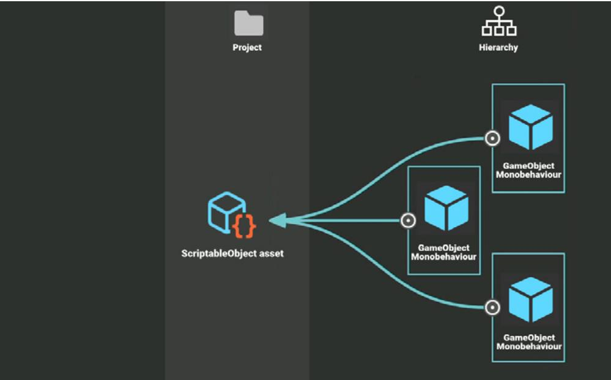

Save memory and stay organized with ScriptableObjects. Set static data and settings in the asset in the project just once, even if you have lots of GameObjects.

Even if you add a thousand instances of a Prefab to your Scene, they still refer to the same data stored in your asset. Setting up the set of values just once guarantees consistency.

As your game scales up with more unit types, simply create more ScriptableObject assets and swap them out appropriately. Maintain your gameplay data just by tweaking the centrally stored assets.

ScriptableObjects don't replace keepin[g persistent data](https://blog.unity.com/games/persistent-data-how-to-save-your-game-states-and-settings) for the rest of your application's save files, where the data may change during gameplay. It's a workflow suited more for storing your static gameplay settings and values. Unlike parsing data from JSON or XML, reading a ScriptableObject asset won't generate garbage (and, as a bonus, it's faster).

#### More resources

- [Create modular game architecture with ScriptableObjects in Unity](https://resources.unity.com/games/create-modular-game-architecture-with-scriptable-objects-ebook?ungated=true)
- [ScriptableObjects Paddle Ball demo project](https://github.com/UnityTechnologies/PaddleGameSO)
- [ScriptableObject documentation](https://docs.unity3d.com/Manual/class-ScriptableObject.html?)
- [Achieve Better Scene Workflow with ScriptableObjects](https://blog.unity.com/technology/achieve-better-scene-workflow-with-scriptableobjects)

#### <span id="page-75-0"></span>Optimization tip

You can use binary serialization formats such as [MessagePack](https://msgpack.org/index.html) or [Protocol](https://developers.google.com/protocol-buffers)  [Buffers](https://developers.google.com/protocol-buffers) for saving data, rather than text-based ones such as JSON or XML. In Project Reviews, these binary serialization formats reduce the memory and performance issues associated with the latter.

#### Managing assemblies

An assembly is a C# code library, a collection of types and resources that are built to work together and form a logical unit of functionality. By default, Unity compiles almost all of your game scripts into the predefined assembly, **Assembly-CSharp.dll**. This works for small projects, but it has some drawbacks:

- Every time you change a script, Unity recompiles all other scripts;
- Any script can access types defined in any other script;
- All scripts are compiled for all platforms.

Organizing your scripts into custom assemblies promotes modularity and reusability. It prevents them from getting added to the default assemblies automatically and limits which other scripts they can access.

You might split up your code into multiple assemblies, as shown in the diagram above. Here, any changes to the code in Main cannot affect the code in Stuff.

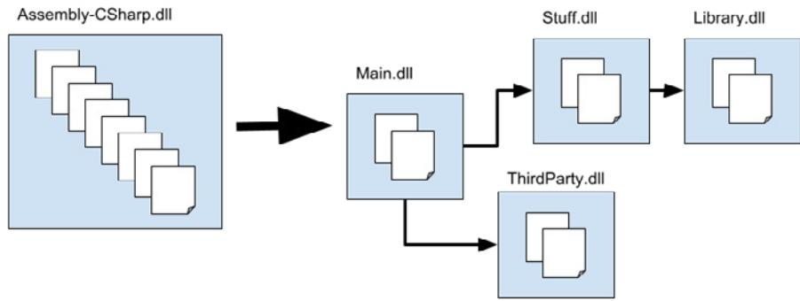

The project split into multiple assemblies

Similarly, because Library doesn't depend on any other assemblies, you can more easily reuse the code in Library in another project.

[Assemblies in .NET](https://docs.microsoft.com/en-us/dotnet/standard/assembly/) has general information about assemblies in C#. Refer to [Assembly definitions](https://docs.unity3d.com/Manual/ScriptCompilationAssemblyDefinitionFiles.html?) in the Unity documentation for more information about defining your own assemblies in Unity.

#### <span id="page-76-0"></span>IDEs and debugging

Unity offers support for the following integrated development environments [\(IDEs\)](https://docs.unity3d.com/Manual/ScriptingToolsIDEs.html?):

- **Visual Studio** (default IDE on Windows and macOS)
- **Visual Studio Code** (Windows, macOS, Linux)
- **JetBrains Rider** (Windows, macOS, Linux)

IDE integrations for all three of these environments appear as packages in the Package Manager.

| Game<br>Package Manager                                          |            |                                                                                                                                                       |
|------------------------------------------------------------------|------------|-------------------------------------------------------------------------------------------------------------------------------------------------------|
| Packages: In Project ▼ Sort: Name (asc) ▼ Filters▼ Clear Filters |            | an<br>a                                                                                                                                               |
| All<br>Services                                                  |            |                                                                                                                                                       |
| @ Services Core                                                  | 1.12.2 V A |                                                                                                                                                       |
| & Shader Graph                                                   | 14.0.10 V  | Visual Studio Editor<br>Remove                                                                                                                        |
| Test Framework                                                   | 1.1.33 V   | 2.0.22 · October 11, 2023<br>  Release                                                                                                                |
| TextMeshPro                                                      | 3.0.6 G    | From Unity Registry by Unity Technologies Inc.                                                                                                        |
| Timeline                                                         | 1.7.6 V    | com.unity.ide.visualstudio                                                                                                                            |
| Unity Ul                                                         | 1.0.0 V    | Documentation Changelog<br>Licenses                                                                                                                   |
| Universal RP                                                     | 14.0.10 V  | Description<br>Version History<br>Dependencies                                                                                                        |
| & Universal RP Config                                            | 14.0.9 V   |                                                                                                                                                       |
| Version Control                                                  | 2.2.0 V    | Code editor integration for supporting Visual Studio as code editor for<br>unity. Adds support for generating csproj files for intellisense purposes, |
| Visual Scripting                                                 | 1.9.1 G    | auto discovery of installations, etc.                                                                                                                 |
| Visual Studio Code Editor                                        | 1.2.5 V    |                                                                                                                                                       |
| Visual Studio Editor                                             | 2.0.22 V   |                                                                                                                                                       |
| Last update Apr 8, 09:23                                         | C          |                                                                                                                                                       |

IDE integrations as packages

Visual Studio is installed by default when you install Unity on **Windows** and **macOS**. If you want to use another IDE, simply browse for the editor in **Unity > Preferences > External Tools > External Script Editor**.

Rider is built on top of [ReSharper](https://www.jetbrains.com/resharper/) and includes most of its features. It supports C# debugging on the .NET 4.6 scripting runtime in Unity (C# 8.0). For more information, see JetBrains's documentation on [Rider for Unity](https://www.jetbrains.com/dotnet/promo/unity/).

VS Code works with many available extensions to function as a full-scale IDE and is a popular code editor for web developers.

You'll need to complete several steps to use VS Code in Unity.

- 1. Download and install Visual Studio Code from its [website,](https://code.visualstudio.com/) where you'll find versions for Windows, macOS, or Linux.
- 2. Get the Visual Studio Editor package for Unity. In the Package Manager window, **be sure to install or, if you have an older version of the package, upgrade to version 2.0.20 or above**.

**Note:** The Visual Studio Editor package now handles the entire family of Visual Studio products. Don't confuse it with the package named Visual Studio Code Editor, which is no longer supported.

<span id="page-77-0"></span>

| .                                        |                             | Package Manager                                                                                 |
|------------------------------------------|-----------------------------|-------------------------------------------------------------------------------------------------|
| Package Manager                          |                             |                                                                                                 |
| + ▼ Packages: In Project ▼ Sort: Name ↓▼ |                             | * a                                                                                             |
| V Unity Technologies                     |                             | Visual Studio Editor   Verified                                                                 |
| > Cinemachine                            | 2.6.3 G                     | Unity Technologies                                                                              |
| High Definition RP                       | 10.2.2 V                    | Version 2.0.7 - February 11, 2021                                                               |
| > JetBrains Rider Editor                 | 2.0.7 V                     | View documentation · View changelog · View licenses                                             |
| Memory Profiler<br>A                     | 0.2.8-preview.2 Preview   1 | Code editor integration for supporting Visual Studio as code editor for unity. Adds support for |
| > Quick Search                           | 202 V                       | generating csproj files for intellisense purposes, auto discovery of installations, etc.        |
| Test Framework                           | 1.1.20 G                    | Registry Unity                                                                                  |
| TextMeshPro<br>A                         | 3.0.1 G                     |                                                                                                 |
| > Timeline                               | 1.4.4 G                     |                                                                                                 |
| Unity Collaborate<br>A                   | 1.3.9 V                     |                                                                                                 |
| A<br>Unity Ul                            | 1.0.0 V                     |                                                                                                 |
| Visual Studio Code Editor<br>A           | 1.2.3 V                     |                                                                                                 |
| Visual Studio Editor                     | 2.0.7 V                     |                                                                                                 |
|                                          |                             |                                                                                                 |
| Last update Apr 6, 16:10                 | C -                         | Remove                                                                                          |


- 3. After installing VS Code and the Visual Studio Editor package, you'll need to set VS Code as the external script editor. Do this via **Unity > Preferences > External Tools** in the Editor. Under **External Script Editor**, choose **Visual Studio Code** from the drop-down menu. If VS Code doesn't appear in the list, click Browse and locate the VS Code executable on your system. The next time you open a C# file in Unity, Unity will open Visual Studio Code for you.
- 4. The next step is to install the Unity extension for Visual Studio Code, which provides a streamlined Unity development experience on Visual Studio Code. It builds on top of the rich C# capabilities provided by the C# Dev Kit and C# extensions as well as integrating natively with Visual Studio Code.

Go to the [Visual Studio Marketplace](https://marketplace.visualstudio.com/items?itemName=visualstudiotoolsforunity.vstuc) for the extension. After you click to download it, a window will open prompting you to open it in the Visual Studio Code application. VS Code will then install the Unity extensions, including C# Dev Kit and C# extensions.

Each IDE has its own productive merits. See [Integrated development](https://docs.unity3d.com/Manual/ScriptingToolsIDEs.html?)  [environment \(IDE\) support](https://docs.unity3d.com/Manual/ScriptingToolsIDEs.html?) for more information about choosing an IDE.

#### Debugging

The Unity Debugger allows you to debug your C# code while the Unity Entity is in Play Mode. You can attach breakpoints within the code editor in order to inspect the state of your script code and its current variables at runtime.

Set the Code Optimization mode to **Debug** in the bottom right of the Unity Editor Status Bar. You can also change this mode on startup at **Edit > Preferences > General > Code Optimization On Startup**.


Debug Mode

In the code editor, set a breakpoint where you want the debugger to pause execution. Simply click over the left margin/gutter area where you want to toggle a breakpoint (or right-click there to use the context menu for more options). A red circle appears next to the line number of the highlighted line (see image below).


Toggling a breakpoint

| Attach to Unity<br>● ● ● >     Debug >   √ Attach to Unity and Play |  |  |  |  |
|---------------------------------------------------------------------|--|--|--|--|
| <<br>ObjectPool.cs<br>×                                             |  |  |  |  |
| Assembly-CSharp.Player ▶ ✈ ObjectPool ▶ [[] Start()                 |  |  |  |  |
| 1<br>using System. Collections;                                     |  |  |  |  |
| 2<br>using System. Collections. Generic;                            |  |  |  |  |
| 3<br>using UnityEngine;                                             |  |  |  |  |
| 11                                                                  |  |  |  |  |

Select **Attach to Unity** in your code editor. In the Unity Editor, run the project.

Attaching the Debugger to Unity

In Play Mode, the application will pause at the breakpoint, giving you time to inspect variables and investigate any unintended behavior.

| LO |                        |   |               |                                               |
|----|------------------------|---|---------------|-----------------------------------------------|
| 17 | private void Start ( ) |   |               |                                               |
| 18 |                        |   | pooledObjects | Count = 14                                    |
| 19 | = ne                   |   | [0]           | "PlayerLaser(Clone) (UnityEngine.GameObject)" |
| 20 | GameObject tmp;        |   | [1]           | "PlayerLaser(Clone) (UnityEngine.GameObject)" |
| 21 | for (int i = 0;        |   | 2             | "PlayerLaser(Clone) (UnityEngine.GameObject)" |
| 22 |                        |   | (3)           | "PlayerLaser(Clone) (UnityEngine.GameObject)" |
| 23 | Instant<br>100         |   | 4             | "PlayerLaser(Clone) (UnityEngine.GameObject)" |
| 24 | tmp. SetActive         |   | 5             | "PlayerLaser(Clone) (UnityEngine.GameObject)" |
| 25 |                        | D | ഗ്            | "PlayerLaser(Clone) (UnityEngine.GameObject)" |
|    |                        |   | [7]           | "PlayerLaser(Clone) (UnityEngine.GameObject)" |
| 26 |                        | > | (8)           | "PlayerLaser(Clone) (UnityEngine.GameObject)" |
| 21 |                        |   | (a)           | "PlayerLaser(Clone) (UnityEngine.GameObject)" |
| 28 |                        |   | [10]          | "PlayerLaser(Clone) (UnityEngine.GameObject)" |
| 29 |                        |   | [11]          | "PlayerLaser(Clone) (UnityEngine.GameObject)" |
|    |                        | A | [12]          | "PlayerLaser(Clone) (UnityEngine.GameObject)" |
|    |                        | P | [13]          | "PlayerLaser(Clone) (UnityEngine.GameObject)" |
|    |                        |   | Baw View      | Count = 14                                    |
|    |                        |   |               |                                               |
|    |                        |   |               |                                               |

Debugging variables

In the example above, you can inspect the variables when debugging, watching the list build up one step at a time during execution.

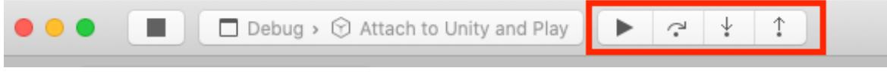

Debug controls: Continue Execution, Step Over, Step Into, and Step Out

Use the **Continue Execution**, **Step Over**, **Step Into** and **Step Out** controls to navigate the control flow.

Press **Stop** to discontinue debugging and resume execution in the Editor.

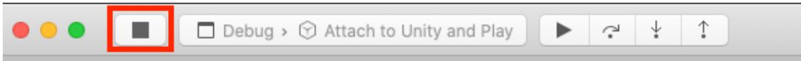

Debug controls: Stop

You can debug script code in a Unity Player as well. Just make sure that **Development Build** and **Script Debugging** are both enabled in the **File > Build Settings** before you build the Player. Check **Wait for Managed Debugger** to wait for the debugger before the Player executes any script code.

To attach the code editor to the Unity Player, select the IP address (or machine name) and port of your player. Then proceed normally in Visual Studio with the **Attach To Unity** option.

#### <span id="page-80-0"></span>Additional debugging tips

Unity also includes a [Debug](https://docs.unity3d.com/Manual/class-Debug.html?) class to help you visualize information in the Editor while it is running. Use it to print messages or warnings into the Console window, draw visualization lines in the Scene view and Game view, and pause Play Mode in the Editor from script.

- 1. Pause execution with **[Debug.Break](https://docs.unity3d.com/ScriptReference/Debug.Break.html?)**. This is useful if you want to check certain values in the Inspector when the application is difficult to pause manually.
- 2. You should be familiar with **[Debug.Log](https://docs.unity3d.com/ScriptReference/Debug.Log.html?)**, **[Debug.LogWarning](https://docs.unity3d.com/ScriptReference/Debug.LogWarning.html?)**, and **[Debug.](https://docs.unity3d.com/ScriptReference/Debug.LogError.html?) [LogError](https://docs.unity3d.com/ScriptReference/Debug.LogError.html?)** for printing Console messages. Also handy is **[Debug.Assert](https://docs.unity3d.com/ScriptReference/Debug.Assert.html?)**, which asserts a condition and logs an error on failure (only works if UNITY\_ ASSERTIONS symbol is defined).


Log messages, warnings, and errors in the Console

- 3. When using **[Debug.Log](https://docs.unity3d.com/ScriptReference/Debug.Log.html?)**, you can pass in an object as the context. If you click on the message in the Console, Unity highlights the GameObject in the Hierarchy window.
- 4. Use [Rich Text](https://docs.unity3d.com/Packages/com.unity.ugui@2.0/manual/StyledText.html) to mark up your **[Debug.Log](https://docs.unity3d.com/ScriptReference/Debug.Log.html?)** statements. This can help you enhance error reports in the Console.
- 5. Unity does not strip the **[Debug](https://docs.unity3d.com/Manual/class-Debug.html?)** logging APIs from non-development builds automatically. Wrap your **Debug Log** calls in custom methods and decorate them with the **[Conditional]** attribute.

Removing the corresponding **Scripting Define Symbol** from the Player Settings compiles out the Debug Logs all at once. This is identical to wrapping them in **#if… #endif** preprocessor blocks.

See this [General Optimizations](https://docs.unity3d.com/Manual/UnderstandingPerformanceGeneralOptimizations.html) guide for an example.

6. Troubleshooting physics? **[Debug.DrawLine](https://docs.unity3d.com/ScriptReference/Debug.DrawLine.html?)** and **[Debug.DrawRay](https://docs.unity3d.com/ScriptReference/Debug.DrawRay.html?)** can help you visualize raycasting.

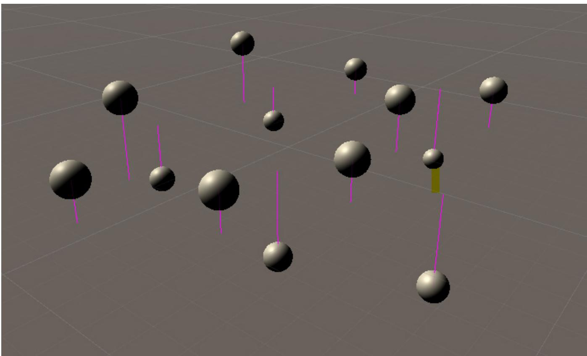

Debug.DrawLine

- 7. If you only want code to run when **Development Build** is enabled, check if **[Debug.isDebugBuild](https://docs.unity3d.com/ScriptReference/Debug-isDebugBuild.html?)** returns true.
- 8. Use **[Application.SetStackTraceLogType](https://docs.unity3d.com/ScriptReference/Application.SetStackTraceLogType.html?)** or the equivalent checkboxes in PlayerSettings to decide which kinds of log messages should include stack traces. Stack traces can be useful, but they are slow and generate garbage.

| Stack Trace* |      |            |      |
|--------------|------|------------|------|
| Log Type     | None | ScriptOnly | Full |
| Error        |      | >          |      |
| Assert       |      | >          |      |
| Warning      |      | >          |      |
| Log          |      | >          |      |
| Exception    |      | >          |      |

#### <span id="page-82-0"></span>Visual Studio shortcuts

If you use Visual Studio as your IDE of choice, these shortcuts may prove useful.

| Action                                             | Shortcut (Windows)  | Shortcut (macOS)                               |
|----------------------------------------------------|---------------------|------------------------------------------------|
| Search your entire project for<br>anything.        | Ctrl + T            | Cmd + .                                        |
| Implement Unity Messages<br>(boilerplate code)     | Ctrl + Shift + M    | Cmd + Shift + M                                |
| Comment out code blocks                            | Ctrl + K / Ctrl + C | Cmd + /                                        |
| Uncomment blocks of code                           | Ctrl + K / Ctrl + U | Cmd + /                                        |
| Copy from clipboard history                        | Ctrl + Shift + V    |                                                |
| View task list                                     | Ctrl + T            | No default keybinding,<br>but you can bind it. |
| Insert a surrounding snippet<br>such as namespace  | Ctrl + K + S        | No default keybinding,<br>but you can bind it. |
| Rename a variable while<br>updating all references | Ctrl + R            | Cmd + R                                        |
| Compile the code                                   | Ctrl + Shift + B    | Cmd + Shift + B                                |

Watch [Visual Studio tips and tricks to boost your productivity](https://www.youtube.com/watch?v=MBWc4oRBwiE) for more workflow improvements with Visual Studio.

#### Device Simulator

 If you're developing for mobile and tablets, the **Device Simulator** can help you simulate your application on different devices. Even if you have physical access to all of your targeted hardware, building the content for each device can be time consuming.


The Simulator view

Use the Simulator view to run a quick preview before you need to make an actual build. You can simulate specific resolutions or hardware conditions and adjust your UI to the physical notch/cutouts in Game view. When using the Simulator view, you can switch between different screens for devices with multiple screens.

| · · () [ [ ] [ ] [ ] [ ] [ ] [ ] [ ] Center @Local                                                                                                                                                                                                                                                    |                                                           | > II >I |                                                                                                    |                          |
|-------------------------------------------------------------------------------------------------------------------------------------------------------------------------------------------------------------------------------------------------------------------------------------------------------|-----------------------------------------------------------|---------|----------------------------------------------------------------------------------------------------|--------------------------|
| Scene Simulator                                                                                                                                                                                                                                                                                       |                                                           |         | E Hierarchy                                                                                        |                          |
| mulator " iPhone XS Max® Restart                                                                                                                                                                                                                                                                      |                                                           |         | ++                                                                                                 | ® All                    |
| Device Specifications                                                                                                                                                                                                                                                                                 | Scale - @ 26 Fit to Screen Rotate ( ) Highlight Safe Area |         |                                                                                                    | T & CanvasSafeAreControl |
| OS: IOS 12.3.1<br>Chipset: N/A<br>CPU: arm64e<br>GPU: Metal<br>Resolution: 1242 x 2688<br>Screen Settings                                                                                                                                                                                             |                                                           |         | Main Camera<br>Directional Light<br>v C Canvas<br>v ( FullScreen<br>BackgroundImage<br>TextT       |                          |
| 2688 1242<br>Set<br>Resolution<br>Full Screen<br>V                                                                                                                                                                                                                                                    |                                                           |         | TextR<br>TextB<br>TextL                                                                            |                          |
| Auto Rotation V<br>Orientation Landscape Left                                                                                                                                                                                                                                                         |                                                           |         | T ( SafeArea                                                                                       |                          |
| V Allowed Orientations<br>Portrait<br>V<br>Portrait Upside Domn<br>V<br>Landscape Left<br>V<br>Landscape Right<br>><br>Player Settings<br>Use Player Settings<br>><br>Resolution Scaling Mode Disabled<br>Auto Rotation<br>Default Orientation<br>4<br>Allowed Orientations<br>Auto Graphics API<br>V | Top<br>it                                                 | Right   | Highlight SafeArea<br>> ( ButtonRed<br>In ButtonBlue<br>ButtonGreen<br>ButtonYellow<br>EventSystem |                          |
| Graphics API<br>Photol                                                                                                                                                                                                                                                                                | -<br>Bottom                                               |         |                                                                                                    |                          |

Adjusting the UI to the device's physical screen

<span id="page-84-0"></span>A list of predefined phones and tablets comes with the package (in the **com. unity.device-simulator/com.unity.device-simulator folder**). Device definitions are stored in JSON files, and the list of devices regularly expands through package updates.

Read ["Speed up mobile iteration with the Device Simulator"](https://blog.unity.com/technology/speed-up-mobile-iteration-with-the-new-device-simulator) for more tips or watch this [demo of the Device Simulator in action.](https://youtu.be/KFJcMG3mlDA?t=872)

#### Console Log Entry

By default, the Console Log Entry shows two lines. For improved readability, you can configure this to be more streamlined with one line (see image).


The Console Log Entry options

Alternatively, you can also use more lines if you want longer entries.

#### <span id="page-85-0"></span>Custom Compiler status

When Unity compiles, the icon in the lower right corner is hard to see. Use this custom Editor script to call [EditorApplication.isCompiling.](https://docs.unity3d.com/ScriptReference/EditorApplication-isCompiling.html?) This makes the Compiler status more visible in a floating window.

Launch the MenuItem to initialize the window. Optionally, you can modify its appearance with a new GUIStyle to suit your preferences.

```
using UnityEditor;
using UnityEngine;
public class CustomCompileWindow : EditorWindow
{
 [MenuItem("Examples/CustomCompileWindow")]
 static void Init()
 {
 EditorWindow window = GetWindowWithRect(typeof(-
CustomCompileWindow), new Rect(0, 0, 200, 200));
 window.Show();
 }
 void OnGUI()
 {
 EditorGUILayout.LabelField("Compiling:", Edito-
rApplication.isCompiling ? "Yes" : "No");
 this.Repaint();
 }
}
```
#### More resources

- *[Ultimate guide to profiling Unity games](https://unity.com/resources/ultimate-guide-to-profiling-unity-games?isGated=false)*
- [How to debug game code with Roslyn Analyzers](https://unity.com/how-to/debugging-with-rosyln-analyzers)
- [How to run automated tests for your games with the Unity Test Framework](https://unity.com/how-to/automated-tests-unity-test-framework)
- [Speed up your debugging workflow with Microsoft Visual Studio Code](https://unity.com/how-to/debugging-with-microsoft-visual-studio-code)
- [How to debug your code with Microsoft Visual Studio 2022](https://unity.com/how-to/debugging-with-microsoft-visual-studio-2022)
- [Testing and quality assurance tips for Unity projects](https://unity.com/how-to/testing-and-quality-assurance-tips-unity-projects)

### <span id="page-86-0"></span>Team workflows

[Unity DevOps](https://unity.com/products/unity-devops) consists of two core components: [Unity Version Control](https://unity.com/solutions/version-control) and [Unity](https://unity.com/solutions/ci-cd)  [Build Automation](https://unity.com/solutions/ci-cd).

When you [sign up for Unity DevOps,](https://docs.unity.com/ugs/en-us/manual/devops/manual/get-started-end-users) you'll get access to both the Version Control and Build Automation components.

You can pick which Unity DevOps component you use. For example, the Build Automation workflows can work with any version control including GitHub. Additionally, Unity Version Control remains compatible with any engine, slotting seamlessly into your existing tech stack.

Unity DevOps is a consumption-based tool. This means that you'll only pay for what you use once you exceed the monthly free tier. You can learn more about pricing on the [Unity DevOps page](https://unity.com/products/unity-devops).

<span id="page-87-0"></span>

Unity helps your team collaborate.

#### Unity Version Control

[Unity Version Control](https://docs.unity.com/ugs/en-us/manual/devops/manual/unity-version-control) (Unity VCS) is a version control and source code management tool for game and real-time 3D development to improve team collaboration and scalability with any engine.

There are two ways to use Unity Version Control. The Unity VCS web experience provides deeply integrated role-based workflows, code reviews, and user and user group management. You can read about setting up the web experience [here.](https://docs.unity.com/ugs/en-us/manual/devops/manual/unity-version-control)

You can also install the [Unity Version Control package](https://docs.unity.com/ugs/en-us/manual/devops/manual/vcs-plugins/unityeditor-plugin/unity-version-control-package) for the Editor. Follow the set up instructions in the [package documentation](https://docs.unity.com/ugs/en-us/manual/devops/manual/vcs-plugins/unityeditor-plugin/get-started-with-vcs-package).

#### Migrating from Git

UVCS can push and pull changes directly to any remote Git server. This is because UVCS supports the https:// and git:// protocols for pushing and pulling changesets.

This feature immediately turns UVCS into a distributed version control system (DVCS) that's fully compatible with Git. The advantage of this is that you can use UVCS or Git on your workstation and still participate in Git projects (GitHub, CodePlex, and many more).

#### **What is GitSync?**

GitSync is a native Windows DVCS connected to GitHub. So, it virtually turns UVCS into a full-fledged Windows client for Git.

**Note:** GitSync is not technically a new Git client. You would be using UVCS on the client-side but can push/pull to Git servers (using https or Git protocols).

If you're a developer using GitHub (or Bitbucket, or maybe CodePlex), there are things you like, like using a cloud-based repository for your code and Windows to develop – and things you don't like, like being forced to use the CLI and lacking really awesome GUI tools.

If you wish you had everything – Cloud repositories, the DVCS power, and tools for Windows – that's what you get with GitSync.

Learn more about migrating from Git in the [UVCS manual](https://docs.unity.com/ugs/en-us/manual/devops/manual/migrating-from-git).

#### **Using Git as an external VCS**

You can also use an external system, such as Git, including [Git LFS \(Large File](https://git-lfs.github.com)  [Support\)](https://git-lfs.github.com) for more efficient version control of your larger assets, like graphics and sound resources.

Unity maintains a [.gitignore](https://github.com/github/gitignore/blob/master/Unity.gitignore) file. This can help you decide what should and shouldn't go into the git repository and enforce those rules.


The GitHub for Unity extension

If you're interested in learning how to set up version control for your team and Unity projects download the free, in-depth guide *[Version control and project](https://unity.com/resources/version-control-project-organization-best-practices-ebook?isGated=false)  [organization best practices for game developers](https://unity.com/resources/version-control-project-organization-best-practices-ebook?isGated=false)*.

#### <span id="page-89-0"></span>Unity Build Automation

Unity DevOps Build Automation, formerly known as Cloud Build, is a turnkey continuous integration and deployment (CI/CD) solution that can execute and deploy builds in the cloud. It empowers you to build and release more often for higher-quality, more innovative releases.

Build Automation can be connected to any source control repository in a matter of minutes and set up to execute builds manually or automatically once any change is committed to version control. Build Automation also supports multiple platforms including iOS, Android, Windows, and Unity Web, eliminating the need to maintain unique build infrastructure for every platform.

#### Unity Accelerator

[Unity Accelerator](https://docs.unity3d.com/Manual/UnityAccelerator.html?) removes waiting time by caching copies of your team's assets. This means that only one person needs to perform the actual import, and the results will automatically be cached to the Unity Accelerator. The next time a team member goes to import the same version of the asset, the Unity Editor first checks the cache before starting the import process on their local machine.

A local administrator dashboard for the Accelerator enables you to configure the tool, see statistics like disk space usage or how much time you've saved, and diagnose issues with logs.

| ili                       |                   | Disk Space Usage                                                                                                                                                                                                                                                                             |                                                                             |
|---------------------------|-------------------|----------------------------------------------------------------------------------------------------------------------------------------------------------------------------------------------------------------------------------------------------------------------------------------------|-----------------------------------------------------------------------------|
| 英 Configuration<br>B Logs | Logs              | ு Basic                                                                                                                                                                                                                                                                                      |                                                                             |
|                           | Collaborate       | Max Usage                                                                                                                                                                                                                                                                                    | b3c-43fb-4fb3-b91e-860dba48625g                                             |
|                           |                   |                                                                                                                                                                                                                                                                                              | ws local machine<br>cal-apparatus-8420.accelerator-7.unity3dusercontent.com |
|                           |                   | Custom                                                                                                                                                                                                                                                                                       | 2259255                                                                     |
|                           |                   | The accelerator will utilize as much disk space as granted. Unchecked values<br>removes restrictions. "Free" values alongside usage values are useful when space is<br>shared with other resources/processes; the accelerator obeys free disk restrictions<br>even before reaching capacity. |                                                                             |
|                           |                   | Percent available to use Percent to remain free                                                                                                                                                                                                                                              | utes                                                                        |
|                           |                   | 43%<br>15%                                                                                                                                                                                                                                                                                   | 8                                                                           |
|                           | Asset Import Pipe | Bytes available to use Bytes to remain free                                                                                                                                                                                                                                                  |                                                                             |
|                           | Maintenance       | 100.0 GB<br>10.7 GB                                                                                                                                                                                                                                                                          |                                                                             |
|                           | Data Policy       | Cancel                                                                                                                                                                                                                                                                                       | P<br>Save drclaw/Library/Unity/accelerator                                  |

Unity Accelerator

<span id="page-90-0"></span>The Accelerator in Unity 2022 LTS provides corruption detection. Accelerator cached assets can be corrupted (modified bytes) on storage or during transmission. A hash of the content detects corrupt content; when content is seen as invalid, it's discarded and imports locally. You can configure this behavior using the Content Validation setting in the Project Settings window (Editor/Cache Server/Content Validation).

See th[e requirements and installation procedure](https://docs.unity3d.com/2022.3/Documentation/Manual/UnityAccelerator.html?) for more information about the Unity Accelerator.

#### Unity Build Server

Consider enhancing your team's productivity by offloading the building process to network hardware using the **[Unity Build Server](https://unity.com/products/unity-build-server)**. This will help your creative team build the project as often as needed, allowing them to iterate more autonomously.

As your Unity project grows in size and complexity, generating a build consumes more and more time. If you're using your development workstations to build a project, you will lose productivity while your team waits for the build to complete.

Unity Build Server runs Unity in batch mode, exclusively for building Unity projects. Team members can request builds on demand at their own pace. This reduces wait time for bug fixes and releasing new features for testing. Building on separate machines reduces each developer's downtime and allows everyone to iterate more quickly.

See the [Unity Build Server](https://unity.com/products/unity-build-server?) page for more information on how to access the service and pricing.


Setting up the Unity Build Server

### <span id="page-91-0"></span>Resources for all Unity developers

You can find additional productivity tips, best practices, and news on the [Unity](https://blog.unity.com/)  [Blog,](https://blog.unity.com/) by searching the **#unitytips** hashtag, and on the [community forums](https://forum.unity.com/) and [Unity Learn.](https://learn.unity.com/)

The [Unity Developer Tools](https://unity.com/developer-tools?) microsite makes it easy for you to find some of the best resources for developing with Unity, including documentation, the Knowledge Base, Issue Tracker, as well as our latest roadmap and release information.

### <span id="page-92-0"></span>Technical Support Success Plans from Unity

Unity provides three tiers of success plans for professional developers and studios. Our success plans are designed to help you minimize technical and strategic obstacles during your game development. Our technical support team will help:

- **Prevent technical roadblocks**: Get recommendations to anticipate, correct, and prevent blockers.
- **Streamline development**: Work directly with Unity experts to help ensure your projects are optimized to achieve your goals.
- **Mitigate risk**: Put guardrails in place that can help you avoid future issues, ensuring your project stays on track and on budget.

Learn more about [Unity Success plans](https://unity.com/success-plans) or [contact us](https://create.unity.com/contact-unity-expert) to get more information about what we can offer.


[unity.com](https://unity.com/)